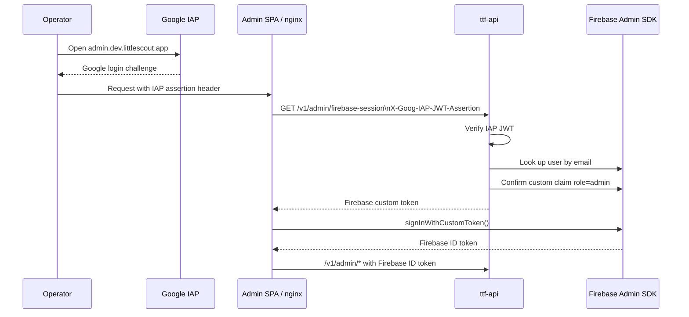

# Admin auth — operator console

How operators reach **`admin.dev.littlescout.app`**. This is **separate** from public app auth documented in [WEB_AUTH.md](WEB_AUTH.md).

Parents use **Firebase sign-in** on `app.dev`. Operators use **Google Cloud IAP** (Google account login at the load balancer) plus **Firebase admin custom claims** for API authorization.

---

## Two layers (do not conflate)

| Layer | What it protects | Technology |
|-------|------------------|------------|
| **Edge / IAP** | Who can load the admin SPA | Google Identity-Aware Proxy on the HTTPS load balancer |
| **App / API** | Who can call `/v1/admin/*` | Firebase JWT with custom claim `role=admin` |

A user can pass IAP but still be denied by the app if they lack the Firebase admin claim. Conversely, a Firebase admin claim alone does **not** bypass IAP in production.

---

## Production flow (admin.dev)



1. Operator opens `https://admin.dev.littlescout.app`.
2. **IAP** prompts for Google account (OAuth client `IAP-ttf-dev-admin-backend` — **not** the Firebase Web client used by `app.dev`).
3. Admin SPA loads and calls same-origin **`/auth/firebase-session`** (nginx proxies to **`GET /v1/admin/firebase-session`** on the API with `X-Goog-IAP-JWT-Assertion`).
4. API verifies IAP JWT, confirms `role=admin` on the Firebase user, returns a **Firebase custom token**.
5. Admin SPA calls `signInWithCustomToken()` — no second Google prompt.
6. Subsequent `/v1/admin/*` calls use the Firebase ID token.

Implementation: `web/src/auth/iapSession.ts`, `web/nginx.admin.conf`, `api/ttf_api/routes/admin.py`.

---

## Grant admin access

One-time per operator email:

```bash
python api/scripts/set_admin_claim.py --email you@example.com
```

Reload `admin.dev` after granting the claim. The Firebase user must exist (e.g. they signed up on the public app or were created in Firebase Console).

---

## Terraform and secrets

IAP is wired by Terraform (`infra/terraform/modules/serverless-lb` and dev environment). GitHub Environment **`dev`** secrets:

| Secret | Purpose |
|--------|---------|
| `IAP_OAUTH_CLIENT_ID` | admin.dev IAP OAuth client |
| `IAP_OAUTH_CLIENT_SECRET` | admin.dev IAP OAuth client |

Terraform provisions the IAP service agent and grants `roles/run.invoker` on `ttf-admin-web` (required for IAP → Cloud Run).

Domain, TLS, and smoke tests: [LITTLESCOUT_DOMAIN.md](LITTLESCOUT_DOMAIN.md).

---

## Local admin development (without IAP)

The admin build (`AdminApp.tsx`) skips the login page in production — IAP handles entry. **Locally**, `/login` shows email/password for developers:

```bash
# Build target: admin (see web/README.md)
cd web && npm run dev:admin   # or equivalent admin dev script
```

Use a Firebase user with the admin claim, or test API routes with:

```bash
# .env
AUTH_DEV_ADMIN_UIDS=<your-firebase-uid>
```

Then `Authorization: Bearer dev:<uid>` on `/v1/admin/*`.

---

## Admin routes

Deployed service: **`ttf-admin-web`** at `https://admin.dev.littlescout.app`.

| Route | Purpose |
|-------|---------|
| `/admin` | Overview |
| `/admin/restaurants` | Restaurant management |
| `/admin/contributors` | Contributor list |
| `/admin/observations` | Observation log |
| `/access-denied` | IAP passed but no admin claim |

API enforcement: `role: admin` custom claim on all `/v1/admin/*` endpoints.

---

## Related docs

| Doc | Purpose |
|-----|---------|
| [WEB_AUTH.md](WEB_AUTH.md) | Public app Firebase sign-up / sign-in |
| [FIREBASE_AUTH.md](FIREBASE_AUTH.md) | JWT verification and API config |
| [LITTLESCOUT_DOMAIN.md](LITTLESCOUT_DOMAIN.md) | DNS, TLS, IAP deploy runbook |
| [ARCHITECTURE.md](ARCHITECTURE.md) | Full system diagram |
