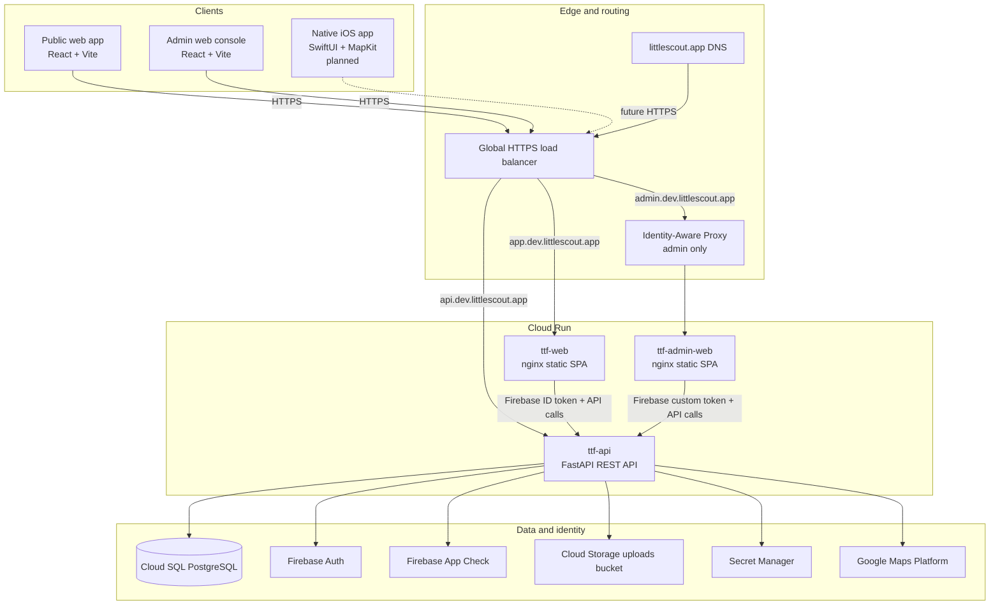
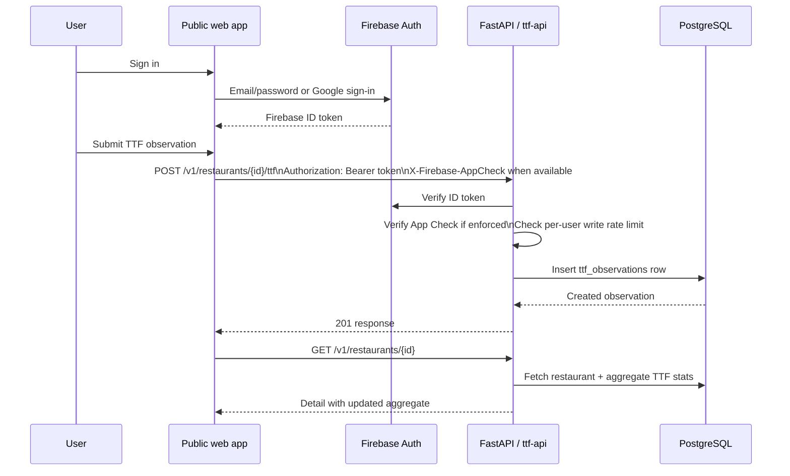
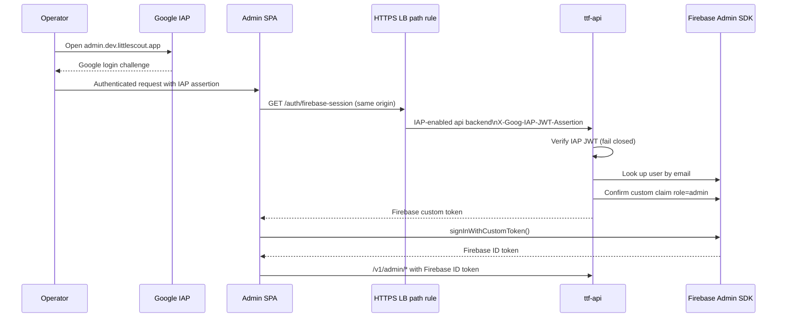
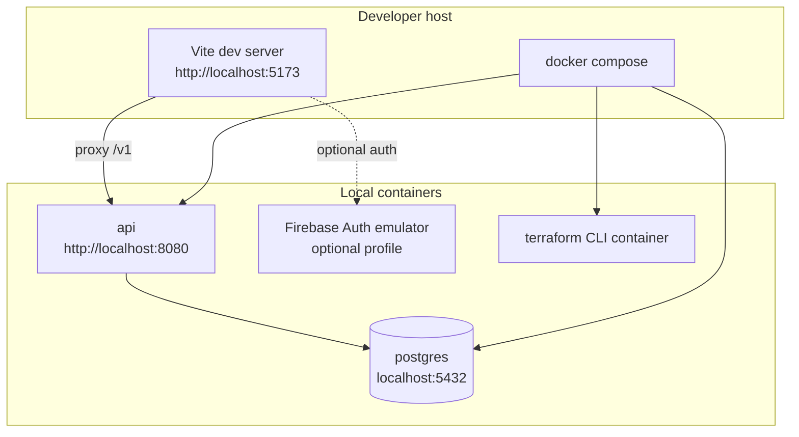
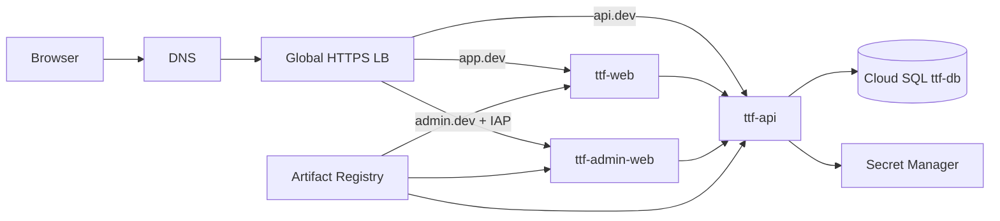
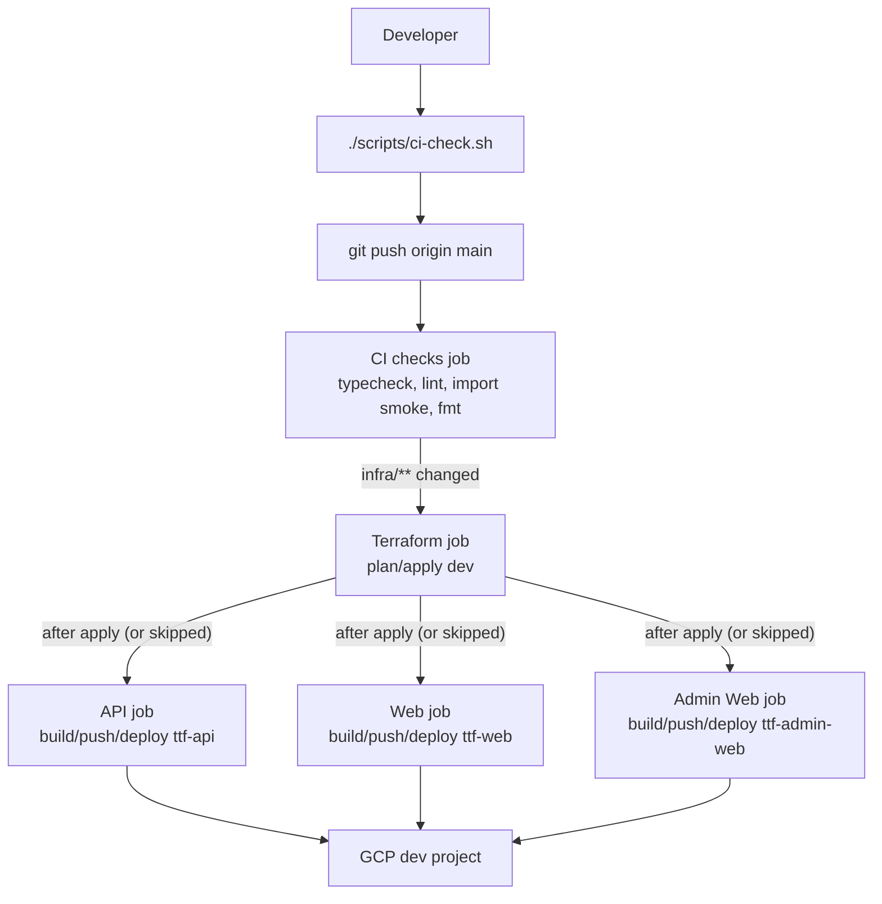

# Little Scout Architecture

This document describes the current Little Scout system: its components, runtime
topology, data model, auth boundaries, and deployment flows.

Little Scout is a parent-focused restaurant rating app for the Dedham,
Massachusetts pilot. The flagship metric is TTF: how long it takes for
kid-friendly food to reach the table, plus what arrived and how good it was.

## Current state

- **Phase:** Phase 2 complete: API, infrastructure, and web POC are present.
- **Pilot city:** `dedham-ma`.
- **Primary runtime:** GCP dev project `ttf-restaurant-dev`.
- **Current clients:** Public web POC and admin web console.
- **Planned client:** Native iOS app in Phase 3. The `ios/` project is not yet
  present in this repository.

## Component map

## Repository layout

| Path | Responsibility |
| --- | --- |
| `web/` | Public web POC and admin console, both built from one React/Vite app tree. |
| `api/` | FastAPI service, migrations, OpenAPI sketch, and operational scripts. |
| `infra/terraform/` | GCP infrastructure for dev, reusable Terraform modules, and bootstrap config. |
| `.github/workflows/` | CI, Terraform, API deploy, public web deploy, and admin web deploy workflows. |
| `docker-compose.yml` | Local Postgres, API, Terraform, and optional Firebase Auth emulator. |
| `docs/` | Product, auth, CI, domain, onboarding, and architecture documentation. |

## Client tier

### Public web app

The public web app is a React 19 + Vite single-page application in `web/`.
It is the browser pilot for Dedham and covers:

- home, restaurant list, map, and restaurant detail routes;
- TTF submission;
- shared attribute rating;
- restaurant notes;
- login and account/MFA screens.

Important files:

- `web/src/App.tsx` - public routes.
- `web/src/pages/MapPage.tsx` - map experience.
- `web/src/pages/RestaurantDetailPage.tsx` - detail and contribution entry points.
- `web/src/pages/TtfSubmitPage.tsx` - TTF submission flow.
- `web/src/api/client.ts` - API calls and auth/App Check headers.
- `web/Dockerfile` and `web/nginx.conf` - production static container.

In local development, Vite proxies `/v1` API calls to the configured API URL so
the browser does not need to call a different localhost origin directly.

### Admin web console

The admin console is built from the same `web/` source tree with
`VITE_BUILD_TARGET=admin`, a separate HTML entry point, and a separate Cloud Run
service. It provides operator views for:

- overview statistics;
- restaurant data;
- contributors;
- observation logs;
- admin account/security pages.

Important files:

- `web/src/AdminApp.tsx` - admin routes.
- `web/src/components/admin/AdminRoute.tsx` - Firebase admin-claim guard.
- `web/src/auth/iapSession.ts` - IAP to Firebase session bootstrap.
- `web/Dockerfile.admin` and `web/nginx.admin.conf` - admin static container
  (the IAP session endpoint is routed by a load-balancer path rule, not nginx).

The deployed admin site is additionally protected by Google Cloud IAP before the
SPA loads.

### iOS app

The iOS app is the planned Phase 3 client. The intended stack is SwiftUI,
MapKit, Core Location, Firebase Auth, and MVVM. At the time of writing the iOS
project has not been scaffolded in the repository, so current architecture flows
are documented around web and API behavior.

## API tier

`ttf-api` is a FastAPI service deployed to Cloud Run and run locally through
Docker Compose. The app is assembled in `api/ttf_api/main.py`; on startup it runs
SQL migrations from `api/migrations/`.

Key routers:

| Router | Prefix | Responsibility |
| --- | --- | --- |
| `health.py` | `/health` | Service health and landing responses. |
| `auth_info.py` | `/v1/auth/config` | Public auth/client configuration hints. |
| `users.py` | `/v1/me` | Current Firebase user profile and derived contribution count. |
| `restaurants.py` | `/v1/restaurants` | Restaurant search, map data, details, TTF, attributes, and notes. |
| `metrics.py` | `/v1/metrics` | Curated metric definition schema. |
| `admin.py` | `/v1/admin` | Admin analytics and IAP to Firebase session bootstrap. |

The API uses Pydantic schemas in `api/ttf_api/schemas.py` and SQL queries against
PostgreSQL. The standalone `api/openapi.yaml` describes the original public
contract, but some implemented endpoints have moved ahead of that file.

## Data tier

PostgreSQL is the system of record for Little Scout data. Firebase Auth is the
identity store; the database stores Firebase UIDs on contribution rows and does
not have a local `users` table.

Core tables:

| Table | Purpose |
| --- | --- |
| `restaurants` | Pilot-city restaurant records, address/location, cuisine tags, and Google link-out fields. |
| `metric_definitions` | Curated parent-friendly attributes such as high chairs, noise, and stroller access. |
| `ttf_observations` | Structured TTF submissions: elapsed time, item type, quality, daypart, party context, optional photo URL. |
| `restaurant_attribute_ratings` | User submissions for curated shared attributes. Values are JSONB because metric types vary. |
| `restaurant_notes` | Freeform restaurant-specific notes plus optional tags. |
| `schema_migrations` | Applied migration tracking. |

Aggregates are computed on read:

- restaurant detail and map responses compute TTF sample size, median minutes,
  average quality, and last update;
- attribute ratings are aggregated in `api/ttf_api/aggregates.py`;
- `/v1/me` derives contribution count across TTF observations, attribute
  ratings, and notes;
- admin endpoints derive overview, contributor, restaurant, and observation
  metrics from the contribution tables.

## Primary user data flow

The same write guard is used for adding restaurants, submitting attribute
ratings, submitting TTF observations, and adding notes.

## Auth and authorization

Little Scout intentionally externalizes user identity to Firebase Auth.

### Public app auth

See **[WEB_AUTH.md](WEB_AUTH.md)** for sign-up vs sign-in on `/login`, Google OAuth setup, MFA, and local emulator flow.

1. The web app signs the user in through Firebase Auth.
2. The Firebase SDK provides an ID token.
3. `web/src/api/client.ts` adds `Authorization: Bearer <token>` to authenticated
   API calls.
4. When App Check is configured, the client also sends `X-Firebase-AppCheck`.
5. `api/ttf_api/auth.py` verifies the Firebase token, or accepts `dev:<uid>`
   tokens when `AUTH_DEV_MODE=true` locally.

Read endpoints are public unless they explicitly depend on `get_current_user`.
Write endpoints use `require_write_access` from `api/ttf_api/security.py`, which
chains:

1. Firebase JWT verification;
2. App Check verification if `APP_CHECK_ENFORCE=true`;
3. Postgres-backed per-user write rate limiting.

### Admin auth

See **[ADMIN_AUTH.md](ADMIN_AUTH.md)** for the full operator flow. Summary:

1. **IAP layer:** `admin.dev.littlescout.app` is protected by Google Cloud IAP at
   the load balancer/backend level.
2. **App/API layer:** the admin SPA signs into Firebase and the API requires a
   Firebase custom claim of `role=admin` for `/v1/admin/*`.

For deployed admin single sign-on:

Admin roles are granted with `api/scripts/set_admin_claim.py`.

## Local runtime

Common local modes:

- API smoke test: `docker compose up -d postgres api`, then call
  `http://localhost:8080/health`.
- Full web POC: run Postgres/API in Compose and `npm run dev` in `web/`.
- Emulator auth: run Compose with the `emulator` profile and configure the web
  app for `VITE_USE_AUTH_EMULATOR=true`.
- Terraform: run the `terraform` Compose service against `infra/terraform`.

The API container uses the same `api/Dockerfile` locally and on Cloud Run.

## GCP dev runtime

Terraform manages the dev stack under `infra/terraform/environments/dev`.
Important modules include:

| Module | Responsibility |
| --- | --- |
| `project-services` | Enables required GCP APIs. |
| `artifact-registry` | Stores API/web/admin container images. |
| `cloud-sql` | Creates the dev PostgreSQL instance. |
| `cloud-run` | Creates the API Cloud Run service. |
| `cloud-run-static` | Creates static Cloud Run services for web and admin. |
| `firebase-web` | Creates Firebase web app config and related outputs/secrets. |
| `firebase-auth` | Configures Identity Platform/Firebase Auth settings such as MFA. |
| `serverless-lb` | Global HTTPS load balancer and managed cert routing. |
| `github-workload-identity` | GitHub Actions OIDC access to GCP without service account keys. |
| `secrets`, `iam`, `storage` | Secret containers, service accounts/IAM, and uploads bucket. |

## Deployment and CI/CD

The repo is configured for solo-development pushes to `main`. A single **CI/CD**
pipeline (`deploy.yml`) runs everything in order: fast CI checks (typecheck, lint,
API app-import smoke, terraform fmt), then Terraform apply when `infra/**` changed,
then path-aware service deploys (which also always run after a successful apply,
since apply can change env vars baked into images). Images are built exactly once,
in the deploy jobs, with real build args.

Workflow responsibilities:

| Workflow | Purpose |
| --- | --- |
| `.github/workflows/deploy.yml` | CI/CD pipeline on push to `main`: checks, then Terraform, then service deploys. |
| `.github/workflows/terraform.yml` | Terraform plan/apply for dev infrastructure (reusable + manual dispatch). |
| `.github/workflows/api.yml` | Build, push, and deploy `ttf-api` (reusable + manual dispatch). |
| `.github/workflows/web.yml` | Build, push, and deploy `ttf-web` (reusable + manual dispatch). |
| `.github/workflows/admin-web.yml` | Build, push, and deploy `ttf-admin-web` (reusable + manual dispatch). |

Deploy workflows use GitHub Workload Identity Federation to authenticate to GCP,
then build images into Artifact Registry and update Cloud Run. Web builds bake in
runtime configuration such as API URL and Firebase config from Secret Manager.

## External integrations

| Integration | Used for |
| --- | --- |
| Firebase Auth | Public sign-in, admin Firebase sessions, MFA, and role custom claims. |
| Firebase App Check | Optional write-endpoint abuse protection. |
| Google Cloud IAP | Admin site access control before the admin SPA loads. |
| Google Maps Platform | Browser map rendering and server-side Places/Geocoding support. |
| Cloud Storage | Provisioned uploads bucket; `photo_url` exists on TTF observations. |
| Secret Manager | DB URL, Firebase config, Maps keys, IAP secrets, and service config. |

## Current gaps and intentional boundaries

- The native iOS app is planned but not yet scaffolded.
- `api/openapi.yaml` is useful as a contract sketch, but it does not yet cover
  every implemented endpoint.
- Photo storage is provisioned and the TTF schema has `photo_url`, but there is
  not yet a dedicated upload flow in the web app or API.
- The production Terraform environment is not fully built out; dev is the active
  environment.
- Google sign-in configuration includes console-managed pieces, documented in
  `docs/WEB_AUTH.md`.

## Reference docs

- Product design: `docs/DESIGN.md`
- Public web auth: `docs/WEB_AUTH.md`
- Admin / IAP auth: `docs/ADMIN_AUTH.md`
- Auth index: `docs/AUTH.md`
- Firebase API auth: `docs/FIREBASE_AUTH.md`
- CI/CD: `docs/CI.md`
- Terraform: `infra/terraform/README.md`
- Custom domains: `docs/LITTLESCOUT_DOMAIN.md`
- Local onboarding: `docs/GETTING_STARTED.md`
