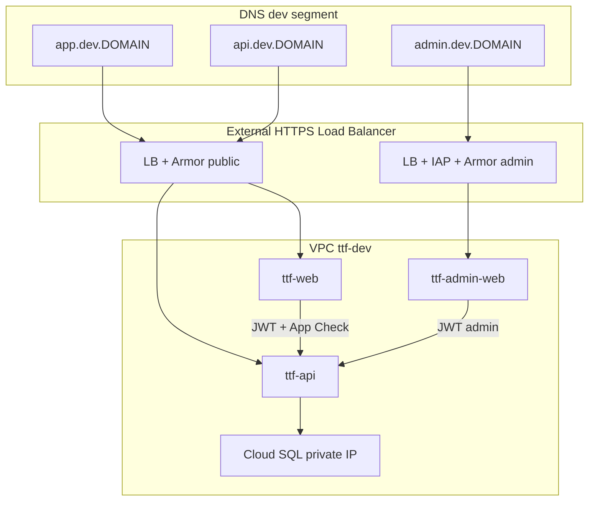

# Custom Domain Setup — Historical Plan

**Status:** Historical planning document. The current implementation runbook is [LITTLESCOUT_DOMAIN.md](LITTLESCOUT_DOMAIN.md).
**Environment:** `ttf-restaurant-dev` (GCP + Firebase) — dev hostnames first; prod mirrors later  
**Last reviewed:** 2026-06-10

This document captured the original custom-domain investigation before the `littlescout.app` dev hostnames were implemented. Treat it as background context only; for DNS records, TLS checks, IAP, smoke tests, and Terraform outputs, use [LITTLESCOUT_DOMAIN.md](LITTLESCOUT_DOMAIN.md).

**Implemented direction:** Segment by **environment** (`dev` vs prod DNS), deploy **admin as its own site** (separate Cloud Run service + hostname), and protect admin with IAP at the load balancer. VPC/network-hardening notes below remain future-planning context unless they are also reflected in Terraform.

---

## Table of Contents

1. [Goals](#1-goals)
2. [Current State](#2-current-state)
3. [Target Architecture — Segmented](#3-target-architecture--segmented)
4. [Admin as a Separate Site](#4-admin-as-a-separate-site)
5. [VPC & Network Segmentation](#5-vpc--network-segmentation)
6. [Touchpoints Matrix](#6-touchpoints-matrix)
7. [DNS & TLS](#7-dns--tls)
8. [Terraform Changes (Proposed)](#8-terraform-changes-proposed)
9. [Console & CI Changes](#9-console--ci-changes)
10. [Implementation Phases](#10-implementation-phases)
11. [Verification Checklist](#11-verification-checklist)
12. [Decisions Needed](#12-decisions-needed)
13. [Risks & Rollback](#13-risks--rollback)
14. [Related Docs](#14-related-docs)

---

## 1. Goals

| Goal | Notes |
|------|-------|
| **Environment-separated DNS** | `*.dev.<DOMAIN>` for `ttf-restaurant-dev`; later `app.<DOMAIN>` / `api.<DOMAIN>` for prod |
| Public web on branded URL | `app.dev.<DOMAIN>` → Cloud Run `ttf-web` |
| Public API on stable hostname | `api.dev.<DOMAIN>` → Cloud Run `ttf-api` (browser + iOS) |
| **Admin on its own site** | `admin.dev.<DOMAIN>` → separate Cloud Run `ttf-admin-web` (not `/admin` on public app) |
| **VPC-backed isolation** | Private Cloud SQL, VPC connector, split ingress; IAP + optional Cloud Armor on admin |
| Firebase Auth per environment | Separate authorized domains / projects for dev vs prod |
| Infrastructure as code | Terraform modules for VPC, LB, Cloud Run ingress — not console-only |
| Safe cutover | Keep `*.run.app` until custom hostnames are verified |

**Non-goals for this pass**

- Firebase Hosting migration (web already runs on Cloud Run + nginx)
- Custom Firebase Auth handler domain (`auth.<DOMAIN>`) — optional later
- Shared VPC across an GCP Organization (no org today — per-project VPC is enough)

---

## 2. Current State

### Hosting

| Surface | Service | Default URL pattern | Code |
|---------|---------|---------------------|------|
| Web POC (Vite SPA) | Cloud Run `ttf-web` | `https://ttf-web-….run.app` | `infra/terraform/environments/dev/web.tf`, `web/` |
| REST API | Cloud Run `ttf-api` | `https://ttf-api-….run.app` | `infra/terraform/environments/dev/phase-b.tf`, `api/` |
| Firebase project | Same GCP project ID | `ttf-restaurant-dev` | `infra/terraform/modules/firebase-web/` |

The web container is a static nginx build. `VITE_API_URL` and Firebase SDK values are **baked in at Docker build time** (`.github/workflows/reusable-web.yml`, `web/Dockerfile`).

### Firebase Auth

Terraform manages Identity Platform authorized domains in `infra/terraform/environments/dev/firebase-auth.tf`:

- `localhost`
- `ttf-restaurant-dev.firebaseapp.com`
- `ttf-restaurant-dev.web.app`
- Cloud Run `ttf-web` hostname (when `enable_web_cloud_run = true`)

`VITE_FIREBASE_AUTH_DOMAIN` in production builds comes from Secret Manager (`ttf-firebase-web-env`) and is typically **`ttf-restaurant-dev.firebaseapp.com`**, not the Cloud Run hostname. That is normal — Firebase Auth does not require `authDomain` to match the page origin, but the **page origin must appear in authorized domains**.

### API CORS

`CORS_ORIGINS` on `ttf-api` is set in `phase-b.tf` to localhost dev ports plus the Cloud Run web URL. A custom web origin must be added or browser calls from the new domain will fail.

### Maps (browser key)

`infra/terraform/environments/dev/maps-web.tf` restricts the web Maps API key to:

- `http://localhost:5173/*`
- Cloud Run `ttf-web` URL + `/*`

Custom web hostnames must be added to `allowed_referrers`.

### App Check (reCAPTCHA Enterprise)

When `app_check_recaptcha_site_key` is set, the reCAPTCHA key’s **allowed domains** must include every web origin (Console step today; see [FIREBASE_AUTH.md](FIREBASE_AUTH.md)).

### Admin UI (today — to be split)

React routes under `/admin` live in the **same** SPA as the public app (`web/src/App.tsx`). Auth is Firebase `role=admin` in the browser; API enforces the same on `/v1/admin/*`. This is convenient for a POC but **does not** give network or blast-radius separation.

### Networking (today — no VPC isolation)

| Component | Current setting | Implication |
|-----------|-----------------|-------------|
| Cloud Run `ttf-web`, `ttf-api` | `ingress = INGRESS_TRAFFIC_ALL` | Public internet can reach services directly |
| Cloud SQL | `ipv4_enabled = true`, no private IP | DB reachable on public IP (auth still required) |
| VPC | **Not provisioned** | No private service mesh; `servicenetworking.googleapis.com` is enabled but unused |
| Load balancer / IAP / Armor | **None** | No edge policy per hostname |

**DNS segmentation without VPC** only changes URLs — all services still share one project network posture. For the separation you want, plan VPC + ingress **with** dev/prod DNS.

---

## 3. Target Architecture — Segmented

### Why not only `/admin` on the public app?

The first draft recommended a `/admin` **path** because it is the fastest POC path (one build, one Cloud Run service, one domain mapping). That is a **delivery** tradeoff, not a security architecture.

| Concern | `/admin` on `app.*` | Separate `admin.*` site |
|---------|---------------------|-------------------------|
| Blast radius | Public + admin JS in one bundle | Admin bundle deployed independently |
| Edge policy | Same ingress as public users | IAP, IP allowlist, or stricter Armor on admin LB only |
| CORS / App Check / Maps keys | Shared web origin | Admin origin listed explicitly; public keys need not trust admin host |
| Discoverability | `/admin` on a marketing-facing URL | Admin hostname can be omitted from public docs |
| Deploy cadence | Ship admin UI with every public web release | Admin releases on their own workflow |

**Recommendation for Little Scout:** Use a **separate admin site** if you care about VPC-level separation and ops isolation — which matches your goals.

### Why a dev DNS segment?

Align DNS with **GCP project boundaries** (already planned as `ttf-restaurant-dev` vs `ttf-restaurant-prod`):

| DNS pattern | GCP project | Firebase | Who uses it |
|-------------|-------------|----------|-------------|
| `app.dev.<DOMAIN>`, `api.dev.<DOMAIN>`, `admin.dev.<DOMAIN>` | `ttf-restaurant-dev` | dev Firebase | Team, pilot testers |
| `app.<DOMAIN>`, `api.<DOMAIN>`, `admin.<DOMAIN>` | `ttf-restaurant-prod` | prod Firebase | Public launch |

Benefits:

- No accidental prod sign-in from dev Firebase config (separate authorized domains and secrets).
- Clear CI mapping: dev workflows → dev hostnames; prod environment approval → prod hostnames.
- Terraform `environments/dev` and `environments/prod` each own a hostname set.
- You can keep `*.run.app` as an internal fallback without exposing it in DNS.

**Alternative:** `dev.app.<DOMAIN>` instead of `app.dev.<DOMAIN>` — pick one convention and stick to it. This doc uses **`app.dev.<DOMAIN>`** (environment before role).

### Target DNS layout (dev first)

| Hostname | Cloud Run service | Audience |
|----------|-------------------|----------|
| `app.dev.<DOMAIN>` | `ttf-web` | Public pilot web |
| `api.dev.<DOMAIN>` | `ttf-api` (public routes) | Web, iOS, read/write API |
| `admin.dev.<DOMAIN>` | `ttf-admin-web` **new** | Operators only |
| `admin-api.dev.<DOMAIN>` *(optional)* | `ttf-api` admin routes only via LB path rules, or internal service later | Tighter split |

Prod (later, separate project): same pattern without `.dev` — `app.<DOMAIN>`, `api.<DOMAIN>`, `admin.<DOMAIN>`.



---

## 4. Admin as a Separate Site

### What “separate site” means (not just another hostname)

Minimum bar:

1. **Separate Cloud Run service** — `ttf-admin-web` (new), not a second domain on `ttf-web`.
2. **Separate container image** — admin-only Vite build (no public map/list routes in the bundle).
3. **Separate hostname** — `admin.dev.<DOMAIN>` (and `admin.<DOMAIN>` in prod).
4. **Separate edge policy** — IAP on the admin load balancer backend; optional corp IP allowlist via Cloud Armor.

### Code / repo changes (planned)

| Piece | Change |
|-------|--------|
| `web/` | Split entry: `web/src/admin-main.tsx` + Vite multi-page build, **or** `web-admin/` package |
| `web/Dockerfile` | Public image `ttf-web`; `Dockerfile.admin` → `ttf-admin-web` |
| `.github/workflows/reusable-web.yml` + `reusable-admin-web.yml` | Deploy jobs (called by `deploy.yml` or manual dispatch) |
| `infra/terraform/.../admin-web.tf` | New `cloud-run-static` module instance for `ttf-admin-web` |
| Firebase | Add `admin.dev.<DOMAIN>` to authorized domains; separate reCAPTCHA key optional (admin may skip Maps) |
| API CORS | Add `https://admin.dev.<DOMAIN>`; public app origin unchanged |
| API `/v1/admin/*` | Still on `ttf-api` initially; protect with JWT `role=admin` **and** consider IAP identity headers later |

### What stays shared (initially)

- **Same API service** (`ttf-api`) serves public and admin routes — acceptable if admin **UI** and **ingress** are isolated. Phase 2 hardening: `INGRESS_TRAFFIC_INTERNAL_ONLY` admin API behind internal LB (only if admin UI calls API from inside VPC — usually overkill while admin is a browser SPA).
- **Same Cloud SQL** — fine inside one VPC; prod uses a different project/instance.

### Remove `/admin` from public app

After `ttf-admin-web` ships:

1. Delete `/admin/*` routes from `web/src/App.tsx` (or guard with build flag excluded from public build).
2. Public image no longer ships admin components (smaller bundle, no admin URL leak).

### IAP vs Firebase for admin

| Layer | Role |
|-------|------|
| **IAP** (recommended on `admin.*`) | Google account allowlist **before** the request hits Cloud Run — stops unauthenticated scanning |
| **Firebase `role=admin`** (keep) | App-level authorization for API writes and UI state — same as today |

Both together: IAP is the single Google login; the API mints a Firebase custom token from the verified IAP JWT so the admin SPA never prompts for Firebase Google sign-in separately.

---

## 5. VPC & Network Segmentation

DNS labels environments; **VPC enforces network boundaries**.

### Target VPC layout (`ttf-restaurant-dev`)

| Resource | Purpose |
|----------|---------|
| `google_compute_network` `ttf-vpc-dev` | Private network for dev |
| Subnet `us-central1` | Serverless VPC Access connector range |
| `google_vpc_access_connector` | Cloud Run → private RFC1918 |
| Service Networking connection | Peering for Cloud SQL private IP |
| Cloud SQL | `ipv4_enabled = false`, `private_network` on VPC |
| Serverless NEGs | Attach Cloud Run services to external HTTPS LB |

### Ingress model per service

| Service | Cloud Run ingress | Front door | Rationale |
|---------|-------------------|------------|-----------|
| `ttf-web` | `INGRESS_TRAFFIC_INTERNAL_LOAD_BALANCER` | External HTTPS LB → serverless NEG | Public app; Armor rate limits |
| `ttf-api` (public) | `INGRESS_TRAFFIC_INTERNAL_LOAD_BALANCER` | External HTTPS LB → serverless NEG | `api.dev.<DOMAIN>`; mobile clients |
| `ttf-admin-web` | `INGRESS_TRAFFIC_INTERNAL_LOAD_BALANCER` | External HTTPS LB + **IAP** | Admin only; Google identity at edge |
| Cloud SQL | Private IP only | Via connector from Cloud Run | No public DB IP |

Direct `*.run.app` URLs can be disabled or left for break-glass only once LB hostnames work.

### Dev vs prod VPC

| Environment | VPC | Peering | Notes |
|-------------|-----|---------|-------|
| Dev | `ttf-vpc-dev` in `ttf-restaurant-dev` | Own Service Networking range | Pilot + team |
| Prod | `ttf-vpc-prod` in `ttf-restaurant-prod` | Separate range | No shared subnets with dev |

Do **not** put dev and prod in one VPC with “logical” separation — project + VPC per environment is simpler and matches your existing two-project design in [DESIGN.md](DESIGN.md).

### Terraform modules to add (sketch)

```
infra/terraform/modules/
  vpc/                 # network, subnet, connector, service networking
  serverless-lb/       # external HTTPS LB, NEG, managed certs, host rules
  iap/                 # OAuth brand + IAP binding on admin backend
```

Update `cloud-run` / `cloud-run-static` modules: `ingress` variable, `invoker_members` default to LB service account (not `allUsers`).

### What VPC does **not** replace

- Firebase authorized domains — still required per hostname.
- JWT admin claims — still required on `/v1/admin/*`.
- App Check on public writes — still required for `app.dev.<DOMAIN>`.

---

## 6. Touchpoints Matrix

When dev hostnames go live, update **every** row (prod hostnames mirror without `.dev`):

| System | What to update | Where today | Dev value |
|--------|----------------|-------------|-----------|
| VPC + connector | Private SQL, LB-only ingress | Not provisioned | `modules/vpc/` |
| External HTTPS LB | Host-based routing to NEGs | Not provisioned | `modules/serverless-lb/` |
| IAP | Admin backend only | Not provisioned | `admin.dev.<DOMAIN>` backend |
| Cloud Run services | `ttf-web`, `ttf-api`, `ttf-admin-web` | 2 services | 3 services; ingress via LB |
| Firebase authorized domains | Sign-in origins | `firebase-auth.tf` | `app.dev.<DOMAIN>`, `admin.dev.<DOMAIN>` |
| API CORS | Browser origins | `phase-b.tf` | `https://app.dev.<DOMAIN>`, `https://admin.dev.<DOMAIN>` |
| Web `VITE_API_URL` | Public build | `reusable-web.yml` | `https://api.dev.<DOMAIN>` |
| Admin `VITE_API_URL` | Admin build | `reusable-admin-web.yml` | `https://api.dev.<DOMAIN>` |
| Maps web key referrers | Public app only | `maps-web.tf` | `https://app.dev.<DOMAIN>/*` (not admin) |
| reCAPTCHA / App Check | Public app | Console + Terraform | `app.dev.<DOMAIN>` |
| Google OAuth JS origins | Sign-in | Console | `app.dev.<DOMAIN>`, `admin.dev.<DOMAIN>` |
| Firebase `authDomain` | SDK config | `ttf-firebase-web-env` | Keep `ttf-restaurant-dev.firebaseapp.com` unless using [custom auth domain](https://firebase.google.com/docs/auth/web/custom-domain) |
| iOS / TestFlight | API base URL | App config | `https://api.dev.<DOMAIN>` (dev) → `https://api.<DOMAIN>` (prod) |
| Cloud SQL | Private IP | `cloud-sql` module | `ipv4_enabled = false` + VPC |

**Important:** `VITE_*` values are baked at Docker build time. Terraform/LB changes alone do not update front-end bundles — rerun **Web** and **Admin Web** workflows.

---

## 7. DNS & TLS

### Domain verification (GCP)

Verify `<DOMAIN>` once per GCP project (Search Console or domain verification TXT).

With **load balancer + managed certificates** (recommended for VPC + IAP):

1. Terraform creates `google_certificate_manager_certificate` (or classic managed SSL certs) for each hostname.
2. DNS points hostnames at the **load balancer IP** (A/AAAA), not per-service Cloud Run domain mappings.

Legacy `google_cloud_run_domain_mapping` is still valid for a quick POC without VPC, but **conflicts with the segmented target** — prefer LB host rules once VPC work starts.

### Typical records (dev segment, LB front door)

| Type | Name | Target |
|------|------|--------|
| A / AAAA | `app.dev` | External LB IP |
| A / AAAA | `api.dev` | Same LB (host-based routing) or separate LB |
| A / AAAA | `admin.dev` | Admin LB (IAP-enabled backend) |
| TXT | `_google-domain-verification` | From GCP verification |

Managed certs provision after DNS propagates.

### Apex `<DOMAIN>`

| Option | Mechanism |
|--------|-----------|
| Registrar redirect | `https://<DOMAIN>` → `https://app.<DOMAIN>` when prod launches |
| Marketing only | Apex on Webflow/Notion; app stays on `app.*` |

### TTL & cutover

- Lower TTL to **300s** before cutover.
- Keep `*.run.app` as break-glass until LB hostnames pass the verification checklist.

---

## 8. Terraform Changes (Proposed)

Introduce variables in `infra/terraform/environments/dev/variables.tf`:

```hcl
variable "dns_environment" {
  type        = string
  description = "DNS segment: dev → app.dev.example.com; prod → app.example.com"
  default     = "dev"
}

variable "dns_base_domain" {
  type        = string
  description = "Registrable domain (example.com). Empty = run.app only."
  default     = ""
}

locals {
  dns_suffix = var.dns_base_domain != "" ? (
    var.dns_environment == "dev" ? ".dev.${var.dns_base_domain}" : ".${var.dns_base_domain}"
  ) : ""
  web_fqdn   = var.dns_base_domain != "" ? "app${local.dns_suffix}" : ""
  api_fqdn   = var.dns_base_domain != "" ? "api${local.dns_suffix}" : ""
  admin_fqdn = var.dns_base_domain != "" ? "admin${local.dns_suffix}" : ""
}
```

### New modules (priority order)

1. **`modules/vpc`** — network, subnet, Serverless VPC Access connector, Service Networking for Cloud SQL.
2. **`modules/serverless-lb`** — external HTTPS LB, serverless NEGs per Cloud Run service, managed certs, URL maps (`app.dev.*` → `ttf-web`, `api.dev.*` → `ttf-api`, `admin.dev.*` → `ttf-admin-web`).
3. **`modules/iap`** — IAP OAuth client + `google_iap_web_backend_service_iam_binding` for admin backend (Google Group allowlist).
4. **`admin-web.tf`** — third `cloud-run-static` instance, `ingress = INTERNAL_LOAD_BALANCER`.

Update **`modules/cloud-sql`**: `ipv4_enabled = false`, `private_network` = VPC self link.

Update **`phase-b.tf`** `CORS_ORIGINS`:

```hcl
concat(
  ["http://localhost:5173", ...],
  local.web_fqdn != "" ? ["https://${local.web_fqdn}", "https://${local.admin_fqdn}"] : [],
)
```

Update **`firebase-auth.tf`** `authorized_domains` with `local.web_fqdn` and `local.admin_fqdn`.

### API URL secrets for CI

Store in Secret Manager (Terraform-managed):

- `ttf-api-public-url` → `https://${local.api_fqdn}`
- `ttf-web-public-url` → `https://${local.web_fqdn}`

`reusable-web.yml` and `reusable-admin-web.yml` read secrets instead of `gcloud run services describe`.

### Optional: `google_dns_managed_zone`

Use if DNS moves to **Cloud DNS**; otherwise output LB IPs and record table for your registrar (Cloudflare, etc.).

---

## 9. Console & CI Changes

### One-time / manual (unless codified later)

| Task | Location |
|------|----------|
| Verify domain in GCP | Search Console / domain verification |
| IAP OAuth consent | OAuth brand for admin LB |
| IAP access list | Google Group for operators |
| Add DNS A/AAAA to LB IPs | Registrar or Cloud DNS |
| reCAPTCHA allowed domains | `app.dev.<DOMAIN>` only (public) |
| OAuth JavaScript origins | `app.dev.<DOMAIN>`, `admin.dev.<DOMAIN>` |

### Workflows

| Workflow | Deploys |
|----------|---------|
| `reusable-web.yml` | `ttf-web` → `app.dev.<DOMAIN>` |
| `reusable-admin-web.yml` | `ttf-admin-web` → `admin.dev.<DOMAIN>` |
| `api.yml` | `ttf-api` (unchanged image path; ingress via LB) |
| `terraform.yml` | VPC, SQL private IP, LB, IAP, secrets |

### Deploy order

```text
1. Terraform: VPC + private Cloud SQL + connectors (may need brief SQL cutover)
2. Terraform: serverless LB + certs + IAP on admin backend
3. DNS: A/AAAA for app.dev, api.dev, admin.dev
4. Split admin build; deploy ttf-admin-web
5. Console: reCAPTCHA + OAuth origins
6. Web + admin-web workflows with secret-based VITE_API_URL
7. Remove /admin routes from public web build
8. Smoke test (checklist below)
```

---

## 10. Implementation Phases

### Phase 0 — Decisions

- [ ] Confirm `<DOMAIN>` and convention (`app.dev.<DOMAIN>` vs `dev.app.<DOMAIN>`)
- [ ] IAP allowlist Google Group for admin
- [ ] DNS at registrar vs Cloud DNS
- [ ] Optional: Cloud Armor rules (geo, rate limit) on public LB

### Phase 1 — VPC foundation (no public DNS yet)

- [ ] `modules/vpc` + private Cloud SQL migration
- [ ] VPC connector on Cloud Run services
- [ ] Verify API health via connector (still on `run.app` temporarily if needed)

### Phase 2 — Load balancers + dev DNS

- [ ] `modules/serverless-lb` with `app.dev`, `api.dev`, `admin.dev` host rules
- [ ] Managed certs + DNS records
- [ ] `modules/iap` on admin backend
- [ ] Secrets: public URLs for CI

### Phase 3 — Split admin site

- [ ] Admin-only Vite build + `ttf-admin-web` Terraform
- [ ] `reusable-admin-web.yml` CI
- [ ] Firebase authorized domains + CORS for admin origin
- [ ] Remove `/admin` from public `ttf-web` bundle

### Phase 4 — Public app on dev hostname

- [ ] `reusable-web.yml` uses `https://api.dev.<DOMAIN>`
- [ ] Maps + App Check for `app.dev.<DOMAIN>` only
- [ ] End-to-end pilot on dev segment

### Phase 5 — Prod mirror

- [ ] `ttf-restaurant-prod` + `ttf-vpc-prod` + `app.<DOMAIN>` / `api.<DOMAIN>` / `admin.<DOMAIN>`
- [ ] Separate Firebase project and secrets (no shared dev prod keys)

---

## 11. Verification Checklist

Run after each phase. Replace hostnames with your values.

### DNS & TLS

- [ ] `dig app.dev.<DOMAIN>` / `api.dev.<DOMAIN>` / `admin.dev.<DOMAIN>` → LB IP
- [ ] Managed certs ACTIVE on all three hostnames
- [ ] `curl -I https://api.dev.<DOMAIN>/health` → `200`

### VPC

- [ ] Cloud SQL has no public IP; Cloud Run connects via connector
- [ ] Cloud Run ingress is LB-only (direct `run.app` not required for users)

### Firebase Auth (public + admin)

- [ ] Sign-in on `https://app.dev.<DOMAIN>/login`
- [ ] Sign-in on `https://admin.dev.<DOMAIN>` (after IAP)
- [ ] Google OAuth works on both origins

### API & CORS

- [ ] Public app calls `https://api.dev.<DOMAIN>/v1/...` without CORS errors
- [ ] Admin dashboard calls `/v1/admin/*` successfully

### IAP (admin)

- [ ] Unauthenticated request to `admin.dev.<DOMAIN>` → IAP login wall
- [ ] Non-group Google account denied
- [ ] Allowed operator reaches admin SPA

### Admin isolation

- [ ] `https://app.dev.<DOMAIN>/admin` → 404 or redirect (removed from public bundle)
- [ ] Admin image does not include public map routes

### Regression

- [ ] `localhost:5173` still works
- [ ] Break-glass `run.app` still works if kept

---

## 12. Decisions Needed

| # | Question | Default recommendation |
|---|----------|------------------------|
| 1 | What is `<DOMAIN>`? | *(fill in)* |
| 2 | Dev DNS convention | `app.dev.<DOMAIN>` (env before role) |
| 3 | Admin separate site? | **Yes** — `ttf-admin-web` + IAP |
| 4 | VPC per project? | **Yes** — `ttf-vpc-dev` / `ttf-vpc-prod` |
| 5 | IAP allowlist | Google Group e.g. `ttf-ops@yourdomain.com` |
| 6 | Custom Firebase Auth domain? | Defer |
| 7 | DNS provider | Cloud DNS or registrar — either works with LB IPs |
| 8 | Retire `run.app` after cutover? | Keep 30-day overlap for ops |

---

## 13. Risks & Rollback

| Risk | Mitigation |
|------|------------|
| DNS propagation delay | Low TTL; test with `/etc/hosts` or `curl --resolve` |
| CORS mismatch | Terraform apply before announcing URL; test in browser |
| Stale web build (old API URL) | Always run Web workflow after API domain change |
| OAuth / App Check domain missing | Console checklist in Phase 4 |
| Cloud SQL private IP migration | Plan maintenance window; take backup before cutover |
| IAP misconfiguration | Test with non-admin Google account before removing `run.app` |
| LB + cert propagation | Allow 15–60 min; keep `run.app` until green checklist |

**Rollback:** Point DNS back to LB previous IPs or re-enable `run.app` ingress. VPC/SQL rollback is harder — take a SQL backup before private IP migration. Revert `dns_base_domain` to `""` in Terraform to drop custom hostnames from Firebase/CORS.

---

## 14. Related Docs

| Doc | Relevance |
|-----|-----------|
| [DESIGN.md](DESIGN.md) | Product and architecture overview |
| [FIREBASE_AUTH.md](FIREBASE_AUTH.md) | Authorized domains, App Check, service account |
| [AUTH.md](AUTH.md) | Google OAuth, admin claims, `/admin` access |
| [web/README.md](../web/README.md) | Local dev and Cloud Run deploy |
| [infra/terraform/README.md](../infra/terraform/README.md) | Phase A/B, Maps keys, CI apply |

---

## Appendix A — Example `terraform.tfvars` (gitignored)

```hcl
dns_base_domain = "example.com"
dns_environment = "dev"   # → app.dev.example.com, api.dev.example.com, admin.dev.example.com
```

## Appendix B — Example registrar DNS (dev segment, LB front door)

| Type | Host | Value |
|------|------|-------|
| TXT | `@` | *(domain verification)* |
| A | `app.dev` | *(external LB IP from Terraform output)* |
| A | `api.dev` | *(same or dedicated LB IP)* |
| A | `admin.dev` | *(admin LB IP — may match public LB with host rules)* |

Prod (later): identical pattern without `.dev` (`app`, `api`, `admin`).
