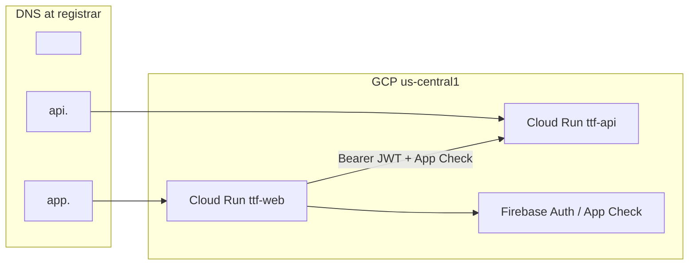

# Custom Domain Setup — Investigation & Plan

**Status:** Investigation / planning (not implemented)  
**Environment:** `ttf-restaurant-dev` (GCP + Firebase)  
**Last reviewed:** 2026-06-10

This document inventories how TTF is hosted today, what must change when you attach a purchased domain, and a phased plan to do it safely. Replace `<DOMAIN>` with your real domain (e.g. `timeto fries.com` → use the registrable apex like `example.com`).

---

## Table of Contents

1. [Goals](#1-goals)
2. [Current State](#2-current-state)
3. [Recommended DNS Layout](#3-recommended-dns-layout)
4. [Admin Site (`/admin`)](#4-admin-site-admin)
5. [Touchpoints Matrix](#5-touchpoints-matrix)
6. [DNS & TLS](#6-dns--tls)
7. [Terraform Changes (Proposed)](#7-terraform-changes-proposed)
8. [Console & CI Changes](#8-console--ci-changes)
9. [Implementation Phases](#9-implementation-phases)
10. [Verification Checklist](#10-verification-checklist)
11. [Decisions Needed](#11-decisions-needed)
12. [Risks & Rollback](#12-risks--rollback)
13. [Related Docs](#13-related-docs)

---

## 1. Goals

| Goal | Notes |
|------|-------|
| Public web app on a branded URL | Map custom hostname → Cloud Run `ttf-web` |
| API reachable on a stable hostname | Map `api.<DOMAIN>` → Cloud Run `ttf-api` (optional for browser; required for iOS/TestFlight) |
| Firebase Auth continues to work | Authorized domains, OAuth redirects, App Check |
| Admin dashboard remains usable | Today: `/admin` path on the same web origin |
| Infrastructure as code | Prefer Terraform over one-off console clicks |
| Keep dev `*.run.app` URLs working during cutover | Parallel operation until DNS propagates |

**Non-goals for this pass**

- Firebase Hosting migration (web already runs on Cloud Run + nginx)
- Custom Firebase Auth handler domain (`auth.<DOMAIN>`) — optional later
- Production GCP project (`ttf-restaurant-prod`) — plan here targets dev/pilot; prod mirrors the same pattern

---

## 2. Current State

### Hosting

| Surface | Service | Default URL pattern | Code |
|---------|---------|---------------------|------|
| Web POC (Vite SPA) | Cloud Run `ttf-web` | `https://ttf-web-….run.app` | `infra/terraform/environments/dev/web.tf`, `web/` |
| REST API | Cloud Run `ttf-api` | `https://ttf-api-….run.app` | `infra/terraform/environments/dev/phase-b.tf`, `api/` |
| Firebase project | Same GCP project ID | `ttf-restaurant-dev` | `infra/terraform/modules/firebase-web/` |

The web container is a static nginx build. `VITE_API_URL` and Firebase SDK values are **baked in at Docker build time** (`.github/workflows/web.yml`, `web/Dockerfile`).

### Firebase Auth

Terraform manages Identity Platform authorized domains in `infra/terraform/environments/dev/firebase-auth.tf`:

- `localhost`
- `ttf-restaurant-dev.firebaseapp.com`
- `ttf-restaurant-dev.web.app`
- Cloud Run `ttf-web` hostname (when `enable_web_cloud_run = true`)

`VITE_FIREBASE_AUTH_DOMAIN` in production builds comes from Secret Manager (`ttf-firebase-web-env`) and is typically **`ttf-restaurant-dev.firebaseapp.com`**, not the Cloud Run hostname. That is normal — Firebase Auth does not require `authDomain` to match the page origin, but the **page origin must appear in authorized domains**.

### API CORS

`CORS_ORIGINS` on `ttf-api` is set in `phase-b.tf` to localhost dev ports plus the Cloud Run web URL. A custom web origin must be added or browser calls from the new domain will fail.

### Maps (browser key)

`infra/terraform/environments/dev/maps-web.tf` restricts the web Maps API key to:

- `http://localhost:5173/*`
- Cloud Run `ttf-web` URL + `/*`

Custom web hostnames must be added to `allowed_referrers`.

### App Check (reCAPTCHA Enterprise)

When `app_check_recaptcha_site_key` is set, the reCAPTCHA key’s **allowed domains** must include every web origin (Console step today; see [FIREBASE_AUTH.md](FIREBASE_AUTH.md)).

### Admin UI

Not a separate service. React routes under `/admin` in the same SPA (`web/src/App.tsx`), gated by Firebase custom claim `role=admin` (`web/src/components/admin/AdminRoute.tsx`, API `/v1/admin/*`).

---

## 3. Recommended DNS Layout

Use **subdomains** for Cloud Run mappings. Apex (`<DOMAIN>`) is possible but needs extra plumbing (global HTTPS load balancer or registrar redirect); subdomains are simpler on Cloud Run.

| Hostname | Points to | Purpose |
|----------|-----------|---------|
| `app.<DOMAIN>` **or** `www.<DOMAIN>` | `ttf-web` | Public web pilot |
| `api.<DOMAIN>` | `ttf-api` | REST API (iOS, future clients, explicit API URL) |
| `<DOMAIN>` (apex) | Redirect → `app.<DOMAIN>` | Marketing / bookmark-friendly (optional) |

**Suggested default:** `app.<DOMAIN>` for the web app, `api.<DOMAIN>` for the API.



---

## 4. Admin Site (`/admin`)

### Current behavior

| URL | Access |
|-----|--------|
| `https://<web-host>/admin` | Firebase sign-in + `role=admin` claim |
| `https://<web-host>/admin/restaurants` | Same |
| `https://<web-host>/admin/users` | Same |
| `https://<web-host>/admin/observations` | Same |

After custom domain cutover, admin URLs become e.g. `https://app.<DOMAIN>/admin` with **no code changes** if the SPA stays on one origin.

### Optional: `admin.<DOMAIN>` subdomain

| Approach | Pros | Cons |
|----------|------|------|
| **A. Keep `/admin` path** (recommended) | Zero routing work; one TLS cert; one Cloud Run mapping; matches current code | Admin URL is discoverable (still protected by auth) |
| **B. Separate `admin.<DOMAIN>`** | Clear separation; can restrict at edge later | Second Cloud Run domain mapping to **same** `ttf-web` image **or** separate deploy; must add hostname to Firebase authorized domains, CORS (if API called from new origin), Maps referrers |
| **C. IP / IAP restrict `admin.<DOMAIN>`** | Stronger ops security | Cloud Armor or Identity-Aware Proxy in front of Cloud Run — more infra |

**Recommendation:** Ship **Approach A** first. Revisit **B/C** only if you want network-level admin isolation.

If you later add `admin.<DOMAIN>` as a second hostname on the same Cloud Run service:

1. Map both hostnames to `ttf-web`.
2. Add `admin.<DOMAIN>` to Firebase authorized domains and Maps referrers.
3. Optionally add nginx logic to redirect `/` on admin host → `/admin` (not required today).

---

## 5. Touchpoints Matrix

When `app.<DOMAIN>` and `api.<DOMAIN>` go live, update **every** row:

| System | What to update | Where today | Custom domain value |
|--------|----------------|-------------|---------------------|
| Cloud Run domain mapping | Map hostname → service | Not in Terraform | `google_cloud_run_domain_mapping` (new) |
| Firebase authorized domains | Allow sign-in from web origin | `firebase-auth.tf` | `app.<DOMAIN>` |
| API CORS | Browser `fetch` from web origin | `phase-b.tf` `CORS_ORIGINS` | `https://app.<DOMAIN>` |
| Web build `VITE_API_URL` | API base URL baked into JS | `web.yml` reads Cloud Run URL | `https://api.<DOMAIN>` (after API mapping) |
| Maps web API key referrers | Maps JS loads only from allowed sites | `maps-web.tf` | `https://app.<DOMAIN>/*` |
| reCAPTCHA Enterprise | App Check allowed domains | GCP Console | `app.<DOMAIN>` |
| Google OAuth client | Authorized JavaScript origins | GCP Console → Credentials | `https://app.<DOMAIN>` |
| Google OAuth client | Redirect URIs (if used) | Same | Firebase handler URLs (usually unchanged if `authDomain` stays default) |
| Firebase `authDomain` in web env | SDK config | `ttf-firebase-web-env` secret | **Keep** `ttf-restaurant-dev.firebaseapp.com` unless you adopt [custom auth domain](https://firebase.google.com/docs/auth/web/custom-domain) |
| iOS / future clients | API base URL | App config (Phase 3) | `https://api.<DOMAIN>` |
| Email links / bookmarks | User-facing URL | — | `https://app.<DOMAIN>` |

**Important:** Changing `VITE_API_URL` requires a **web image rebuild and redeploy** (`web.yml`). Terraform-only changes are not enough for the front end.

---

## 6. DNS & TLS

### Domain verification (GCP)

Before mappings work, verify domain ownership once per GCP project:

1. [Cloud Run → Domain mappings](https://console.cloud.google.com/run/domains) or `gcloud run domain-mappings create`.
2. Google provides a **TXT** record for `_google-domain-verification` (or use Search Console verification).
3. After verification, create mappings per service; Google shows required **CNAME** or **A/AAAA** records.

### Typical records (subdomains)

For `app.<DOMAIN>` → `ttf-web`:

| Type | Name | Target |
|------|------|--------|
| CNAME | `app` | `ghs.googlehosted.com` (exact target shown in Cloud Run UI after mapping) |

For `api.<DOMAIN>` → `ttf-api`: same pattern with name `api`.

Cloud Run provisions **managed TLS** for mapped domains automatically once DNS propagates.

### Apex `<DOMAIN>`

| Option | Mechanism |
|--------|-----------|
| Registrar redirect | `https://<DOMAIN>` → `https://app.<DOMAIN>` (easiest) |
| Cloud Load Balancer | A/AAAA to LB → serverless NEG → Cloud Run (Terraform-heavy) |
| `www` only | Skip apex; use `www.<DOMAIN>` as canonical web host |

### TTL & cutover

- Lower TTL on affected records to **300s** before cutover.
- Keep `*.run.app` URLs active; do not remove Cloud Run default URLs until custom domain is verified end-to-end.

---

## 7. Terraform Changes (Proposed)

Introduce variables in `infra/terraform/environments/dev/variables.tf`:

```hcl
variable "web_custom_domain" {
  type        = string
  description = "Browser-facing hostname for ttf-web (e.g. app.example.com). Empty = run.app only."
  default     = ""
}

variable "api_custom_domain" {
  type        = string
  description = "API hostname for ttf-api (e.g. api.example.com). Empty = run.app only."
  default     = ""
}
```

### New file: `domains.tf` (sketch)

```hcl
resource "google_cloud_run_domain_mapping" "web" {
  count    = var.enable_web_cloud_run && var.web_custom_domain != "" ? 1 : 0
  location = var.region
  name     = var.web_custom_domain

  metadata {
    namespace = var.project_id
  }

  spec {
    route_name = module.cloud_run_web[0].service_name # add output if missing
  }
}

resource "google_cloud_run_domain_mapping" "api" {
  count    = var.enable_cloud_run && var.api_custom_domain != "" ? 1 : 0
  location = var.region
  name     = var.api_custom_domain
  # ... same pattern for ttf-api
}
```

> **Note:** Confirm resource compatibility with `google_cloud_run_v2_service` in your provider version; domain mapping resources target the Cloud Run **service name** in the project/region. Add module outputs for service names if not already exposed.

### Wire domains into existing modules

**`firebase-auth.tf`** — extend `authorized_domains`:

```hcl
var.web_custom_domain != "" ? [var.web_custom_domain] : []
```

**`phase-b.tf`** — extend `CORS_ORIGINS`:

```hcl
var.web_custom_domain != "" ? ["https://${var.web_custom_domain}"] : []
```

**`maps-web.tf`** — extend referrers:

```hcl
var.web_custom_domain != "" ? ["https://${var.web_custom_domain}/*"] : []
```

### API URL for web builds

Today `web.yml` discovers API URL via `gcloud run services describe ttf-api`. Options:

| Option | Description |
|--------|-------------|
| **A. Secret** | Store `https://api.<DOMAIN>` in Secret Manager; Terraform writes it when `api_custom_domain` is set; `web.yml` prefers secret over `gcloud describe` |
| **B. Terraform output only** | Manual `workflow_dispatch` input until secret exists |
| **C. Keep run.app for API** | Custom domain only on web; CORS still needs web custom origin |

**Recommendation:** **A** — single source of truth, works for iOS config later (`ttf-api-base-url` secret).

### Optional: `google_dns_managed_zone`

Only if the domain’s DNS is delegated to **Cloud DNS**. If DNS stays at Namecheap, Cloudflare, etc., apply records manually from Terraform outputs or a small `docs/` runbook table — do not create a managed zone unless you plan to move DNS to GCP.

---

## 8. Console & CI Changes

### One-time / manual (unless codified later)

| Task | Location |
|------|----------|
| Verify domain in GCP | Cloud Run domain mappings |
| Add DNS records | Domain registrar |
| reCAPTCHA allowed domains | [reCAPTCHA Enterprise](https://console.cloud.google.com/security/recaptcha) |
| OAuth JavaScript origins | [APIs & Services → Credentials](https://console.cloud.google.com/apis/credentials) → Web client used by Firebase Google sign-in |
| Apex redirect | Registrar or load balancer |

### `.github/workflows/web.yml`

After Terraform stores public URLs in Secret Manager:

1. Read `ttf-web-public-url` / `ttf-api-public-url` (names TBD) when present.
2. Fall back to `gcloud run services describe` for backward compatibility.
3. Re-run **Web** workflow after Terraform apply so `VITE_API_URL` matches `api.<DOMAIN>`.

### Deploy order

```text
1. Terraform: domain mappings + authorized_domains + CORS + maps referrers + secrets
2. DNS: add records at registrar; wait for propagation
3. Console: reCAPTCHA + OAuth origins
4. Web workflow: rebuild with new VITE_API_URL
5. Smoke test (checklist below)
```

Path-filtered workflows: changes under `infra/**` trigger **Terraform**; `web/**` triggers **Web**. A domain-only infra change needs Terraform apply **and** a Web redeploy (manual `workflow_dispatch` on Web if `web/` did not change).

---

## 9. Implementation Phases

### Phase 0 — Decisions (you)

- [ ] Confirm apex vs `app.` vs `www.` canonical hostname
- [ ] Confirm `api.<DOMAIN>` hostname
- [ ] Confirm DNS stays at registrar vs move to Cloud DNS
- [ ] Fill in `<DOMAIN>` in this doc or `terraform.tfvars`

### Phase 1 — Domain verification (no user impact)

- [ ] Verify `<DOMAIN>` in GCP (TXT record)
- [ ] Add Terraform variables (empty default); plan only

### Phase 2 — API custom domain

- [ ] `google_cloud_run_domain_mapping` for `api.<DOMAIN>`
- [ ] DNS CNAME for `api`
- [ ] Wait for TLS active
- [ ] `curl https://api.<DOMAIN>/health`
- [ ] Store public API URL in Secret Manager (optional but recommended)

### Phase 3 — Web custom domain

- [ ] Domain mapping for `app.<DOMAIN>`
- [ ] Terraform: authorized domains, CORS, Maps referrers
- [ ] DNS CNAME for `app`
- [ ] Console: reCAPTCHA + OAuth origins
- [ ] Rebuild/deploy web with `VITE_API_URL=https://api.<DOMAIN>`
- [ ] Test login, map, TTF submit, `/admin`

### Phase 4 — Apex & cleanup

- [ ] Registrar redirect `<DOMAIN>` → `app.<DOMAIN>`
- [ ] Update any hardcoded `run.app` links in docs/scripts
- [ ] Optional: remove `run.app` hostnames from CORS after soak period

### Phase 5 — Prod mirror

When `ttf-restaurant-prod` exists, repeat with prod hostnames (e.g. `app.<DOMAIN>` on prod project or env-specific subdomains like `app.dev.<DOMAIN>`).

---

## 10. Verification Checklist

Run after each phase. Replace hostnames with your values.

### DNS & TLS

- [ ] `dig app.<DOMAIN>` / `dig api.<DOMAIN>` returns expected CNAME
- [ ] `curl -I https://app.<DOMAIN>` → `200` (or `304`)
- [ ] `curl -I https://api.<DOMAIN>/health` → `200`

### Firebase Auth

- [ ] Email/password sign-in on `https://app.<DOMAIN>/login`
- [ ] Google sign-in (no `redirect_uri_mismatch` / `unauthorized-domain`)
- [ ] MFA enrollment on `/account` if enabled

### API & CORS

- [ ] Browser network tab: API calls go to `https://api.<DOMAIN>/v1/...` without CORS errors
- [ ] Authenticated write (e.g. TTF submit) succeeds with App Check header when enforced

### Maps & App Check

- [ ] Map page loads tiles (no RefererNotAllowedMapError)
- [ ] No App Check console errors on load

### Admin

- [ ] `https://app.<DOMAIN>/admin` loads for user with admin claim
- [ ] Non-admin redirected to `/restaurants`
- [ ] Admin API stats load (`/v1/admin/stats`)

### Regression

- [ ] `localhost:5173` dev still works
- [ ] Old `*.run.app` URL still works until intentionally retired

---

## 11. Decisions Needed

| # | Question | Default recommendation |
|---|----------|------------------------|
| 1 | What is `<DOMAIN>`? | *(fill in)* |
| 2 | Web hostname: `app.`, `www.`, or apex? | `app.<DOMAIN>` |
| 3 | API hostname | `api.<DOMAIN>` |
| 4 | Admin: path vs `admin.` subdomain? | Keep `/admin` on web hostname |
| 5 | Custom Firebase Auth domain (`auth.<DOMAIN>`)? | Defer; use `*.firebaseapp.com` |
| 6 | DNS provider | Registrar UI unless moving to Cloud DNS |
| 7 | Retire `run.app` URLs after cutover? | Keep 30-day overlap |

---

## 12. Risks & Rollback

| Risk | Mitigation |
|------|------------|
| DNS propagation delay | Low TTL; test with `/etc/hosts` or `curl --resolve` |
| CORS mismatch | Terraform apply before announcing URL; test in browser |
| Stale web build (old API URL) | Always run Web workflow after API domain change |
| OAuth / App Check domain missing | Console checklist in Phase 3 |
| Apex SSL complexity | Use registrar redirect instead of apex on Cloud Run |

**Rollback:** Point DNS back to previous targets (or stop using custom URLs). `*.run.app` endpoints remain unless services are deleted. Revert Terraform variables to empty strings and re-apply to drop custom domains from Firebase/CORS/Maps config.

---

## 13. Related Docs

| Doc | Relevance |
|-----|-----------|
| [DESIGN.md](DESIGN.md) | Architecture; mentions `api.ttf.app` as future custom API domain |
| [FIREBASE_AUTH.md](FIREBASE_AUTH.md) | Authorized domains, App Check, service account |
| [AUTH.md](AUTH.md) | Google OAuth, admin claims, `/admin` access |
| [web/README.md](../web/README.md) | Local dev and Cloud Run deploy |
| [infra/terraform/README.md](../infra/terraform/README.md) | Phase A/B, Maps keys, CI apply |

---

## Appendix A — Example `terraform.tfvars` (gitignored)

```hcl
# After domain verification in GCP:
web_custom_domain = "app.example.com"
api_custom_domain = "api.example.com"
```

## Appendix B — Example registrar DNS (illustrative)

| Type | Host | Value |
|------|------|-------|
| TXT | `@` or `_google-domain-verification` | *(from GCP verification)* |
| CNAME | `app` | *(from Cloud Run mapping for ttf-web)* |
| CNAME | `api` | *(from Cloud Run mapping for ttf-api)* |
| URL redirect | `@` | `https://app.example.com` |

Exact CNAME targets are **not** generic — copy them from the Cloud Run domain mapping screen after creation.
