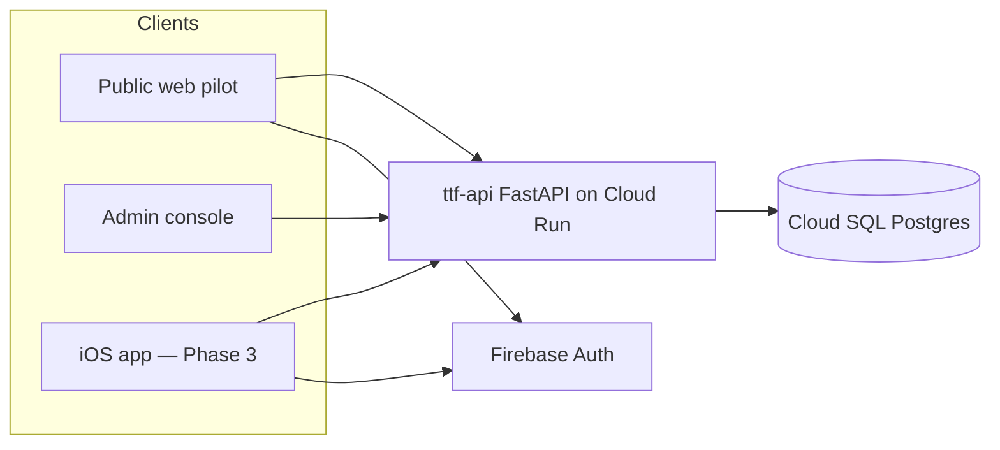
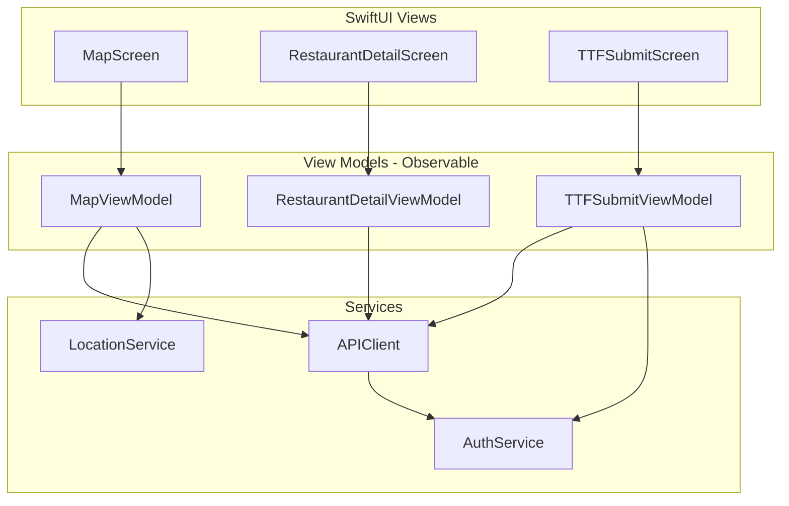
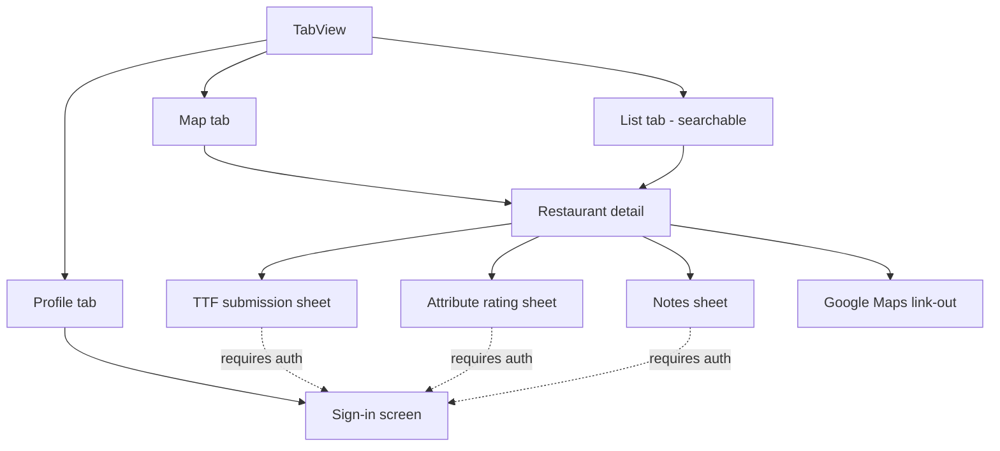

# Little Scout iOS — Phase 3 Implementation & Design

**Scope:** native iOS MVP (`ios/TTF/`) connecting to the existing Phase 2 backend
**Status:** scaffold on `main` — `ios/TTF/` builds in Xcode; M1 browse (map/list/detail) implemented; Apple Sign-In + TestFlight (M4–M6) still open
**Prereqs already done:** API + Postgres live at `https://api.dev.littlescout.app`, Firebase Auth configured, pilot restaurants seeded, Apple Developer Program enrolled

This document operationalizes the Phase 3 plan sketched in [DESIGN.md](DESIGN.md) and [GETTING_STARTED.md](GETTING_STARTED.md). It is written against the **implemented** API (see `api/ttf_api/routers/`), not the original `api/openapi.yaml` sketch, which has drifted.

---

## Table of Contents

1. [Where iOS Fits](#1-where-ios-fits)
2. [Tooling & Workflow — Cursor vs Xcode](#2-tooling--workflow--cursor-vs-xcode)
3. [Decision Summary](#3-decision-summary)
4. [Project Scaffolding](#4-project-scaffolding)
5. [App Architecture](#5-app-architecture)
6. [Screens & Navigation](#6-screens--navigation)
7. [API Contract & Swift Models](#7-api-contract--swift-models)
8. [Auth](#8-auth)
9. [Environments & Configuration](#9-environments--configuration)
10. [Map & TTF Tiers](#10-map--ttf-tiers)
11. [Testing Strategy](#11-testing-strategy)
12. [CI/CD — iOS Workflow](#12-cicd--ios-workflow)
13. [Milestones](#13-milestones)
14. [Out of Scope & Open Questions](#14-out-of-scope--open-questions)

---

## 1. Where iOS Fits

The backend is done and battle-tested by the web pilot. The iOS app is a **third client** of the same API — it adds nothing server-side except (eventually) Apple Sign-In provider config and App Check for iOS.



Practical consequences:

- **The web pilot (`web/`) is the reference implementation.** Every iOS screen has a working web equivalent (`MapPage.tsx`, `RestaurantDetailPage.tsx`, `TtfSubmitPage.tsx`). When in doubt about request/response shapes or UX flow, read the web code.
- **`web/src/types.ts` is the de-facto client contract.** Swift models below mirror it.
- **No backend changes are required for the iOS MVP.** Read endpoints are public; writes need a Firebase ID token, which the iOS Firebase SDK provides exactly like the web SDK does.

---

## 2. Tooling & Workflow — Cursor vs Xcode

**Short answer: write the code in Cursor; use Xcode on your Mac as the build/run/preview tool.** Both point at the same `ios/TTF/` folder in this repo. You do not need to "code in Xcode" — but you do need Xcode installed, because only Xcode (macOS) can compile Swift for iOS, run the simulator, render SwiftUI Previews, and manage signing.

| Task | Tool | Notes |
|------|------|-------|
| Writing Swift/SwiftUI code | **Cursor** (or Cursor Cloud agents) | Plain `.swift` text files — agents can write the whole app |
| Project file changes (`project.pbxproj`), adding SPM packages | Cursor agents or Xcode | Agents can edit the project safely; Xcode UI also works |
| Building, running, simulator | **Xcode on your Mac** | `⌘R`, or `xcodebuild` from the Mac terminal |
| SwiftUI Previews (live rendering) | Xcode canvas | No Cursor equivalent |
| Signing, certificates, capabilities (Sign in with Apple) | Xcode + Apple Developer portal | One-time setup, then mostly untouched |
| Asset catalogs, app icon | Xcode (or raw `.xcassets` JSON in Cursor) | `.xcassets` is editable text + images |
| TestFlight distribution | GitHub Actions macOS runner | Phase 3 CI, after local builds work |

### The loop in practice

1. **One-time on your Mac:** create the Xcode project at `ios/TTF/` (bundle ID `com.samueljoeharris.ttf`), commit it. This is the only step that genuinely needs the Xcode GUI first.
2. **Day to day:** prompt Cursor (local or Cloud Agent) to implement features → pull the branch on your Mac → open `ios/TTF/TTF.xcodeproj` in Xcode → `⌘R` to build and run in the simulator → report compile errors or visual issues back to Cursor.
3. **Cloud Agent limitation:** Cloud Agents run on Linux and **cannot compile or run iOS code**. They can write Swift, edit the project file, and reason about the API — but build verification happens on your Mac (or on a macOS CI runner once `ios.yml` exists, which gives agents compile feedback via CI logs).
4. **Tightening the loop (optional):** once `ios.yml` runs `xcodebuild build test` on every `ios/**` push, an agent-authored branch gets automated compile/test feedback without you touching Xcode.

### Keeping the project Cursor-friendly

- Prefer **many small `.swift` files in folders** over giant files — better for diffs and agent edits.
- Use **Xcode 16+ folder-synchronized groups** (the default for new projects): files added on disk appear in Xcode automatically, so agents can add files without editing `project.pbxproj`.
- Add dependencies via **Swift Package Manager only** (no CocoaPods) — SPM state lives in the project file and `Package.resolved`, both text.

---

## 3. Decision Summary

| Decision | Choice | Rationale |
|----------|--------|-----------|
| UI framework | SwiftUI, iOS 17+ deployment target | Per DESIGN.md; iOS 17 gives modern `Observable`, `MapKit` for SwiftUI APIs |
| Architecture | MVVM — `@Observable` view models, plain service structs | v1 simplicity; matches DESIGN.md §8 |
| Concurrency | Swift Concurrency (`async/await`) only | No Combine, no callbacks |
| Networking | `URLSession` + `Codable`, hand-rolled thin client | Mirrors `web/src/api/client.ts`; no Alamofire needed |
| Maps | MapKit + Core Location | Per DESIGN.md §7 |
| Auth | Firebase Auth SDK (SPM: `firebase-ios-sdk`) — Sign in with Apple + email/password | Same Firebase project as web (`ttf-restaurant-dev`) |
| Dependencies | `firebase-ios-sdk` only (`FirebaseAuth` product; `FirebaseAppCheck` later) | Minimize SPM graph; everything else is first-party |
| Project format | Plain `.xcodeproj` with folder-synchronized groups | No XcodeGen/Tuist — solo dev, one target, not worth the indirection |
| Persistence | None in MVP — in-memory + `URLCache` | Read API is fast and public; offline support is post-MVP |
| Min sample / tier logic | Server-side (aggregates come precomputed) | Client only maps `median_minutes` → tier color |

---

## 4. Project Scaffolding

### Xcode project settings

| Setting | Value |
|---------|-------|
| Project path | `ios/TTF/TTF.xcodeproj` |
| App target | `TTF` |
| Display name | `Little Scout` |
| Bundle ID | `com.samueljoeharris.ttf` |
| Deployment target | iOS 17.0 |
| Interface | SwiftUI · Swift 5.10+ |
| Capabilities | Sign in with Apple; later: Push (post-MVP) |
| Info.plist keys | `NSLocationWhenInUseUsageDescription` ("Show kid-friendly restaurants near you") |

### Source layout

```
ios/TTF/
├── TTF.xcodeproj
├── TTF/
│   ├── TTFApp.swift              # @main, Firebase configure, root routing
│   ├── AppEnvironment.swift      # base URL + dependency wiring
│   ├── Config/
│   │   ├── Dev.xcconfig          # API_BASE_URL, USE_AUTH_EMULATOR
│   │   └── Release.xcconfig
│   ├── Models/                   # Codable mirrors of API schemas
│   │   ├── Restaurant.swift      # RestaurantSummary, RestaurantDetail, RestaurantMapEntry
│   │   ├── TTFObservation.swift  # TtfAggregate, TtfSubmission
│   │   ├── Attributes.swift      # MetricDefinition, AttributeEntry
│   │   ├── Note.swift
│   │   └── UserProfile.swift
│   ├── Networking/
│   │   ├── APIClient.swift       # request building, auth header, error mapping
│   │   └── APIError.swift
│   ├── Services/
│   │   ├── AuthService.swift     # Firebase wrapper: sign in/out, token, user stream
│   │   └── LocationService.swift # Core Location wrapper
│   ├── Features/
│   │   ├── Map/                  # MapScreen + MapViewModel
│   │   ├── RestaurantList/       # searchable list
│   │   ├── RestaurantDetail/     # detail + aggregates + link-out
│   │   ├── TTFSubmit/            # timer-based submission flow
│   │   ├── Attributes/           # shared attribute rating UI
│   │   ├── Notes/
│   │   ├── Auth/                 # sign-in screen
│   │   └── Profile/              # /v1/me, contribution count, sign out
│   ├── Components/               # TTFBadge, TierPin, QualityStars, etc.
│   └── Resources/Assets.xcassets
├── TTFTests/                     # unit tests (models, view models, tier logic)
└── TTFUITests/                   # minimal smoke test
```

### Secrets and gitignore

- **`GoogleService-Info.plist` is gitignored** (repo policy: no API keys in git, even though Firebase client keys are not strictly secret). Download it from Firebase Console → iOS app registration, drop into `ios/TTF/TTF/`. CI gets it from a GitHub Secret (base64) at build time.
- `.xcconfig` files contain only non-secret config (URLs, flags) and **are committed**.
- Add to root `.gitignore`: `ios/**/GoogleService-Info.plist`, `ios/**/xcuserdata/`, `ios/**/*.xcuserstate`.

---

## 5. App Architecture

MVVM with a thin service layer; one `@Observable` view model per screen.



Rules of thumb:

- **Views** are dumb: bind to view model state, fire intents (`await viewModel.load()`).
- **View models** own screen state (`enum LoadState { idle, loading, loaded(T), failed(String) }`), call services, never import SwiftUI beyond `Observation`.
- **`APIClient`** is the only thing that knows about URLs and JSON. It asks `AuthService` for a fresh ID token when a request needs auth — the Firebase SDK handles refresh, same as `getIdToken()` on web.
- **Dependency injection** via initializer parameters from `AppEnvironment` — no third-party DI framework.
- JSON decoding uses `keyDecodingStrategy = .convertFromSnakeCase` + `ISO8601` dates with fractional seconds (API returns Pydantic datetimes).

---

## 6. Screens & Navigation

`TabView` with three tabs; contribution flows are sheets pushed from the detail screen.



| Screen | Source endpoint(s) | Notes |
|--------|--------------------|-------|
| **Map** | `GET /v1/restaurants/map` | All pilot-city venues with TTF aggregate per pin; pin color by tier; center on Dedham, recenter via Core Location |
| **List / search** | `GET /v1/restaurants?q=` | `.searchable` modifier; rows show name, address, cuisine tags |
| **Restaurant detail** | `GET /v1/restaurants/{id}`, `GET .../attributes`, `GET .../notes` | TTF badge (median + quality + sample size + last updated), attribute aggregates with `status` handling (`ok` / `early` / `insufficient_data` → "Be the first to rate"), notes list, Google Maps link-out via `google_maps_url` |
| **TTF submission** | `POST /v1/restaurants/{id}/ttf` | The flagship flow — see below |
| **Attribute rating** | `GET /v1/metrics`, `POST .../attributes` | Render input widget per `MetricDefinition.input_widget`: toggle / slider / enum picker |
| **Notes** | `POST /v1/restaurants/{id}/notes` | Freeform text + optional tags |
| **Sign-in** | Firebase SDK | Sign in with Apple (primary), email/password (parity with web pilot) |
| **Profile** | `GET /v1/me` | Display name, email, contribution count, sign out |

### TTF submission flow (the 60-second loop)

The product goal is submitting a TTF observation **in under 60 seconds during a meal**. Design around a live timer, matching `TtfSubmitPage.tsx` but better suited to the at-the-table context:

1. **"We just ordered" button** → starts a timer (`ordered_at = now`), persists start time in memory + `UserDefaults` so backgrounding the app doesn't lose it.
2. **"Food's here!" button** → stops the timer (`served_at = now`); the API computes `elapsed_minutes` server-side when both timestamps are sent.
3. **Quick capture form** (one screen, big tap targets): item type segmented control (`fries / apple_slices / bread / kids_meal / other`), quality 1–5 stars, portion size, daypart (pre-selected from current time), kids party size stepper, optional wait context text.
4. **Manual fallback:** "Skip timer" path lets the user enter `elapsed_minutes` directly (1–180, matching API validation).
5. Submit → optimistic confirmation → detail screen refreshes aggregates.

Photo upload is **deferred** — `photo_url` exists in the schema but there is no upload endpoint yet (known gap, see [ARCHITECTURE.md](ARCHITECTURE.md) §gaps).

---

## 7. API Contract & Swift Models

Base URLs: `https://api.dev.littlescout.app` (deployed dev) or `http://localhost:8080` (Compose; from the simulator on the same Mac, plain `localhost` works).

Endpoints the MVP consumes (all implemented today in `api/ttf_api/routers/`):

| Method | Path | Auth | iOS use |
|--------|------|------|---------|
| GET | `/health` | — | connectivity check in debug screen |
| GET | `/v1/auth/config` | — | detect emulator/dev mode at launch (debug builds) |
| GET | `/v1/restaurants?q=` | — | list/search |
| GET | `/v1/restaurants/map` | — | map pins with TTF aggregates |
| GET | `/v1/restaurants/{id}` | — | detail + TTF aggregate |
| GET | `/v1/restaurants/{id}/ttf` | — | refresh aggregate after submit |
| POST | `/v1/restaurants/{id}/ttf` | Bearer | TTF submission |
| GET | `/v1/restaurants/{id}/attributes` | — | attribute aggregates |
| POST | `/v1/restaurants/{id}/attributes` | Bearer | attribute rating |
| GET | `/v1/restaurants/{id}/notes` | — | notes list |
| POST | `/v1/restaurants/{id}/notes` | Bearer | add note |
| GET | `/v1/metrics` | — | metric definitions (cache per session) |
| GET | `/v1/me` | Bearer | profile + contribution count |

Not consumed by iOS MVP: `POST /v1/restaurants` (venues are seeded), seed-job and `/v1/admin/*` endpoints.

### Representative Swift models

Mirrors of `api/ttf_api/schemas.py` / `web/src/types.ts` (snake_case handled by the decoder):

```swift
struct RestaurantSummary: Codable, Identifiable, Hashable {
    let id: UUID
    let name: String
    let address: String
    let lat: Double
    let lng: Double
    let cuisineTags: [String]
    let pilotCity: String
}

struct TtfAggregate: Codable, Hashable {
    let sampleSize: Int
    let medianMinutes: Double?
    let avgQuality: Double?
    let lastUpdated: Date?
}

struct RestaurantMapEntry: Codable, Identifiable {
    let id: UUID
    let name: String
    let address: String
    let lat: Double
    let lng: Double
    let cuisineTags: [String]
    let pilotCity: String
    let ttf: TtfAggregate
    let noteCount: Int
    let attributeRatingCount: Int
}

struct TtfSubmission: Encodable {
    var orderedAt: Date?
    var servedAt: Date?
    var elapsedMinutes: Int?      // manual fallback; 1...180
    var itemType: ItemType        // fries, appleSlices, bread, kidsMeal, other
    var itemQuality: Int          // 1...5
    var portionSize: PortionSize  // kid, regular, shareable
    var daypart: Daypart          // breakfast, lunch, dinner, late
    var partySizeKids: Int        // 1...12
    var waitContext: String?
}
```

Error handling mirrors the web `ApiError`: non-2xx → decode `{"detail": "..."}` → typed `APIError(status:detail:)`; surface 401 as a sign-in prompt, 429 (rate limit) as a friendly "slow down" message.

---

## 8. Auth

Same Firebase project as web (`ttf-restaurant-dev`); see [FIREBASE_AUTH.md](FIREBASE_AUTH.md) for the API side.

### Providers

| Provider | Priority | Notes |
|----------|----------|-------|
| **Sign in with Apple** | Primary (and an App Store requirement once any third-party sign-in ships) | Needs: capability in Xcode, provider enabled in Firebase Console (hybrid console step per DESIGN.md §9), nonce flow via `ASAuthorizationAppleIDProvider` → `OAuthProvider.credential` |
| Email/password | Secondary | Already enabled; parity with web pilot, useful for testing |
| Google | Post-MVP | Web has it; adds a dependency on iOS — skip for v1 |

### Flow

1. `FirebaseApp.configure()` in `TTFApp` init (requires `GoogleService-Info.plist`).
2. `AuthService` exposes `currentUser` (via `addStateDidChangeListener` bridged to an `AsyncStream`) and `func idToken() async throws -> String`.
3. `APIClient` attaches `Authorization: Bearer <idToken>` on write requests only — reads stay public/anonymous, so browsing requires no account (matches web).
4. Contribution CTAs gate on auth state: tapping "Submit TTF" while signed out presents the sign-in sheet, then resumes.

### Local development without cloud secrets

- **Firebase Auth emulator:** `Auth.auth().useEmulator(withHost: "localhost", port: 9099)` when `USE_AUTH_EMULATOR` is set in `Dev.xcconfig` — mirrors `VITE_USE_AUTH_EMULATOR` ([WEB_AUTH.md](WEB_AUTH.md) option A). Test user `pilot@ttf.test` / `pilotpass123`.
- **Dev tokens:** against a local API with `AUTH_DEV_MODE=true`, the client can send `Bearer dev:<uid>` — handy for previews and UI tests with zero Firebase setup.

### App Check (post-MVP, before public TestFlight)

The API already supports `X-Firebase-AppCheck` enforcement. iOS uses **App Attest** via `FirebaseAppCheck`. Defer until the core app works; enable before opening TestFlight beyond internal testers.

---

## 9. Environments & Configuration

| Build config | API base URL | Auth | Use |
|--------------|--------------|------|-----|
| Debug (default) | `https://api.dev.littlescout.app` | Real Firebase | Day-to-day simulator work against seeded data |
| Debug (local override) | `http://localhost:8080` | Emulator or `dev:` tokens | Full-stack work when changing API + iOS together |
| Release / TestFlight | `https://api.dev.littlescout.app` | Real Firebase | Pilot beta (prod project/domain later) |

Mechanics: `API_BASE_URL` and `USE_AUTH_EMULATOR` live in `.xcconfig` files, surfaced through `Info.plist` → read once into `AppEnvironment`. No URLs hard-coded in views or services.

Note the docker-compose stack runs on your Mac, not in the simulator — `localhost` from the simulator reaches the Mac host directly, so no `host.docker.internal` is needed for the simulator case (only for a *containerized* client, which iOS never is). A physical device on the same Wi-Fi needs the Mac's LAN IP instead; prefer the deployed dev API for device testing.

---

## 10. Map & TTF Tiers

- `Map` (SwiftUI MapKit) with `Annotation` per `RestaurantMapEntry`, initial camera on Dedham (`42.2436, -71.1677`, ~3 km span).
- Tier logic is a pure function — unit-test it:

| Tier | Rule (from DESIGN.md §5) | Pin color |
|------|--------------------------|-----------|
| Fast | `median_minutes ≤ 8` and `sample_size ≥ 3` | Green |
| OK | `9–15 min` | Yellow |
| Slow | `> 15 min` | Red |
| Unknown | `sample_size < 3` or no median | Gray |

- Tapping a pin shows a compact card (name, TTF badge) → navigates to detail.
- Core Location: request when-in-use on first map appearance; degrade gracefully to the Dedham default if denied. No geo-querying server-side in MVP — `/v1/restaurants/map` returns the whole pilot city (~115 rows), filter client-side if needed.

---

## 11. Testing Strategy

| Layer | Approach |
|-------|----------|
| Models | Decoding tests against **recorded JSON fixtures** captured from the live dev API (`curl https://api.dev.littlescout.app/v1/restaurants/map > fixture.json`) — catches contract drift |
| Tier logic, daypart inference, timer math | Plain unit tests (pure functions) |
| View models | Unit tests with a stub `APIClientProtocol`; assert load states and submission payloads |
| API client | Tests with `URLProtocol` stub: header injection, snake_case decoding, error mapping (401/429/422) |
| UI | One XCUITest smoke test (launch → list renders against a stubbed client); don't over-invest per AGENTS.md "no tests that only assert obvious behavior" |
| Manual | Simulator against deployed dev API is the primary loop; device via TestFlight |

Run locally with `⌘U` or `xcodebuild test -scheme TTF -destination 'platform=iOS Simulator,name=iPhone 16'`; same command in CI.

---

## 12. CI/CD — iOS Workflow

Manual iOS build workflow `.github/workflows/tool-ios.yml` (`workflow_dispatch` only today; slot already planned in DESIGN.md §10):

| Stage | Trigger | Runner | Steps |
|-------|---------|--------|-------|
| **Build + test** (M1) | push to `main` touching `ios/**` | `macos-15` | checkout → select Xcode → write `GoogleService-Info.plist` from secret → `xcodebuild build test` (simulator destination, no signing) |
| **TestFlight** (M6) | manual `workflow_dispatch` (later: tags) | `macos-15` | archive → sign with App Store Connect API key (`.p8` in GitHub Secrets) → upload via `xcrun altool`/fastlane → `ttf-pilot-testers` group |

Notes:

- macOS runners burn minutes ~10× Linux — keep the build job out of `deploy.yml` until signing secrets exist; path-filter when wired. `./scripts/ci-check.sh` stays Docker-only and ignores `ios/**`.
- Signing assets (App Store Connect API key, distribution cert) are the one-time Mac setup item from GETTING_STARTED Phase 1; store as GitHub Secrets, never in repo.

---

## 13. Milestones

Ordered so every milestone produces something runnable in the simulator; M1–M3 need no Apple-paid features and no signing beyond a free team.

| # | Milestone | Contents | Done when |
|---|-----------|----------|-----------|
| **M0** | Scaffold | Xcode project at `ios/TTF/` per §4; commit; `.gitignore` entries; placeholder app boots | ✅ on `main` — see [`ios/TTF/README.md`](../ios/TTF/README.md) |
| **M1** | Read-only browse + CI | Models, `APIClient`, list + search, restaurant detail with TTF badge against dev API; `tool-ios.yml` build+test | ✅ browse in simulator; CI workflow is manual `workflow_dispatch` until signing secrets exist |
| **M2** | Map | Map tab, tier-colored pins, pin → detail, Core Location recenter | ✅ Markers + `RestaurantStore` cache on `main`; polish ongoing |
| **M3** | Auth | Firebase SDK, email/password sign-in, `/v1/me` profile tab, emulator support | Sign in on simulator; profile shows contribution count |
| **M4** | Contribute | TTF timer flow, attribute rating, notes — all writes with Bearer token | Submit from simulator; aggregates refresh; rows visible in admin console |
| **M5** | Apple Sign-In + polish | Sign in with Apple (capability + Firebase provider), empty/error/loading states, app icon, accessibility pass | SIWA works on simulator; app feels shippable |
| **M6** | TestFlight | Signing assets → GitHub Secrets, archive+upload stage in `ios.yml`, `ttf-pilot-testers` internal group | Beta build installable from TestFlight on your phone |

Suggested branch naming per repo convention: `feature/ttf-ios-scaffold`, `feature/ttf-ios-browse`, etc. Each milestone is a coherent push to `main` (CI runs on push, not PRs).

---

## 14. Out of Scope & Open Questions

**Out of scope for iOS MVP** (consistent with DESIGN.md §13):

- Photo upload on TTF submissions (no API upload flow yet)
- Push notifications, offline persistence, iPad/visionOS layouts
- Google sign-in on iOS; account deletion UI (required before App Store *public* release — see [BEST_PRACTICES.md](BEST_PRACTICES.md); TestFlight beta is fine without it, plan it before App Store submission)
- Adding new restaurants from the app (venues are seeded server-side)

**Open questions:**

| Question | Current lean |
|----------|--------------|
| Min iOS version 17 vs 16? | 17 — pilot testers are friends/family on recent phones; `@Observable` + new MapKit APIs are worth it |
| Manual `elapsed_minutes` entry vs timestamps-only? | Support both; API already accepts either |
| App Check enforcement timing | After M4, before external TestFlight testers |
| Prod API domain for App Store build | Defer with the rest of the prod environment (`ttf-restaurant-prod`) |

---

*Companion docs: [DESIGN.md](DESIGN.md) (product spec), [ARCHITECTURE.md](ARCHITECTURE.md) (system as built), [FIREBASE_AUTH.md](FIREBASE_AUTH.md) / [WEB_AUTH.md](WEB_AUTH.md) (auth details), [GETTING_STARTED.md](GETTING_STARTED.md) (phase checklist).*
