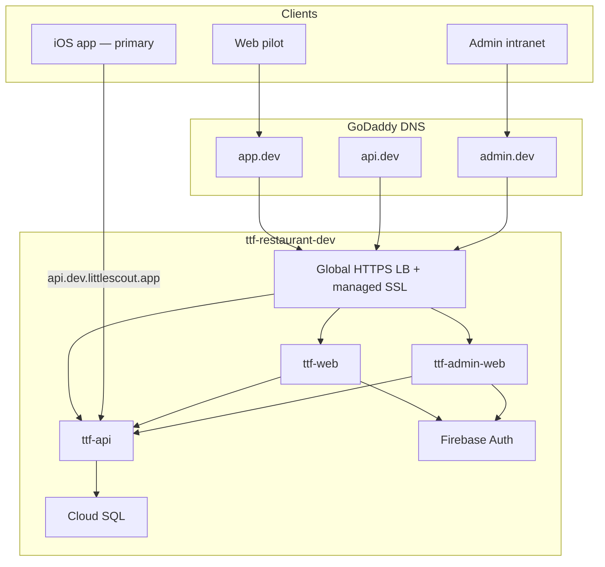

# littlescout.app — Domain, DNS & Deployment Runbook

**Domain:** `littlescout.app` (GoDaddy)  
**GCP project (dev):** `ttf-restaurant-dev`  
**Product model:** iOS app = primary UX; web = secondary pilot; **admin** = operator intranet + management console

---

## Hostname map (dev)

| GoDaddy host | FQDN | Cloud Run service | Audience |
|--------------|------|-------------------|----------|
| `app.dev` | `app.dev.littlescout.app` | `ttf-web` | Public web pilot |
| `api.dev` | `api.dev.littlescout.app` | `ttf-api` | iOS app, web, admin API |
| `admin.dev` | `admin.dev.littlescout.app` | `ttf-admin-web` | You (operator intranet) |

**Prod (later, `ttf-restaurant-prod`):** `app.littlescout.app`, `api.littlescout.app`, `admin.littlescout.app`

**Apex `littlescout.app`:** Use GoDaddy **domain forwarding** → `https://app.littlescout.app` when prod launches (or a marketing page).

---

## Architecture



Terraform: `infra/terraform/environments/dev/` with `dns_base_domain = "littlescout.app"` in [`ci.tfvars`](../infra/terraform/environments/dev/ci.tfvars).

---

## What Terraform provisions (in repo)

| Resource | File / module |
|----------|----------------|
| Global static IP + HTTPS LB | `modules/serverless-lb`, `networking.tf` |
| Google-managed SSL cert (all 3 hostnames) | same |
| Host routing (`app.dev` → web, etc.) | same |
| `ttf-admin-web` Cloud Run | `admin-web.tf` |
| Firebase authorized domains | `firebase-auth.tf` |
| API CORS origins | `phase-b.tf` |
| Maps key referrers (public web only) | `maps-web.tf` |
| Secrets `ttf-api-public-url`, `ttf-web-public-url`, `ttf-admin-public-url` | `networking.tf` |
| IAP on admin backend | `networking.tf`, `ci.tfvars`, `iap.tf` |

After `terraform apply`, get DNS targets:

```bash
docker compose run --rm terraform -chdir=environments/dev output load_balancer_ip
docker compose run --rm terraform -chdir=environments/dev output -json godaddy_dns_records
```

---

## GoDaddy setup (manual)

### 1. Domain verification in Google Cloud (one-time)

Before the managed SSL certificate becomes **ACTIVE**, Google must verify you own `littlescout.app`:

1. Open [Google Search Console](https://search.google.com/search-console) → add property `littlescout.app`
2. Choose **Domain** verification → copy the **TXT** record
3. In GoDaddy: **My Products → littlescout.app → DNS → Add record**
   - Type: **TXT**
   - Name: `@` (root)
   - Value: `google-site-verification=...`
   - TTL: 600 seconds (10 min) during setup
4. Verify in Search Console

Alternatively use the TXT record shown when creating the load balancer / certificate in GCP Console.

### 2. A records → load balancer IP

GoDaddy **Host** field = subdomain only (omit `.littlescout.app`).  
**Value** = `load_balancer_ip` from Terraform output (same IP for all three).

| Type | Name (GoDaddy Host) | Value | TTL |
|------|---------------------|-------|-----|
| A | `app.dev` | `<LB_IP>` | 600 |
| A | `api.dev` | `<LB_IP>` | 600 |
| A | `admin.dev` | `<LB_IP>` | 600 |

Steps in GoDaddy UI:

1. [GoDaddy DNS management](https://dcc.godaddy.com/manage/) → **littlescout.app** → **DNS**
2. **Add** → Type **A**
3. Name: `app.dev` (not `app.dev.littlescout.app`)
4. Value: paste LB IP (IPv4 only)
5. TTL: **Custom** → 600 seconds
6. Repeat for `api.dev` and `admin.dev`
7. **Save**

Propagation: usually minutes; allow up to 48 hours globally.

### 3. SSL certificate status

```bash
gcloud compute ssl-certificates list --project=ttf-restaurant-dev --global
```

Status stays `PROVISIONING` until DNS points at the LB. When correct → `ACTIVE`.

Test:

```bash
curl -I https://api.dev.littlescout.app/health
```

### 4. Apex forwarding (optional, later)

GoDaddy → **Forwarding** → `littlescout.app` → `https://app.littlescout.app` (301).  
Do **not** use forwarding for `api.dev` or `admin.dev`.

### 5. GoDaddy protections (recommended)

| Protection | Where | Notes |
|------------|-------|-------|
| **2FA** on GoDaddy account | Account settings | Required for domain changes |
| **Domain Protection** | GoDaddy product | Extra verification on DNS edits |
| **Lock domain** | Domain settings | Prevents unauthorized transfers |
| **Low TTL during cutover** | DNS records | 600s; raise to 3600 after stable |

GCP-side (after DNS):

| Protection | Where | Notes |
|------------|-------|-------|
| **Cloud Armor** | LB backend policy | Rate limit / geo block (optional Terraform later) |
| **IAP** | Admin LB backend | Google login wall before admin SPA |
| **Firebase App Check** | Public web only | Already in stack |
| **Maps key referrers** | `maps-web.tf` | Only `app.dev.littlescout.app` |

---

## IAP for admin intranet (enabled)

`admin.dev.littlescout.app` is protected by **Identity-Aware Proxy** before traffic reaches Cloud Run.

Terraform enables IAP on the admin load balancer backend and reads OAuth credentials from the **`ttf-iap-oauth`** Secret Manager secret (JSON: `client_id`, `client_secret`).

Configured in [`ci.tfvars`](../infra/terraform/environments/dev/ci.tfvars):

```hcl
enable_admin_iap  = true
iap_admin_members = ["user:samueljoeharris@gmail.com"]
```

### One-time OAuth client setup

Google no longer allows creating IAP OAuth clients via Terraform (`google_iap_brand` / `google_iap_client` API is shut down). Personal Gmail projects also cannot use the auto-managed client (502: empty OAuth client).

1. [GCP Console → Security → IAP](https://console.cloud.google.com/security/iap?project=ttf-restaurant-dev)
2. OAuth consent screen: **External**, support email = your Gmail
3. Backend **`ttf-dev-admin-backend`** → turn **IAP ON** → create OAuth client → copy **Client ID** and **Secret**

Then choose **one** bootstrap path:

**A — GitHub Environment secrets (recommended for CI apply)**

In repo **Settings → Environments → dev**, add:

| Secret | Value |
|--------|--------|
| `IAP_OAUTH_CLIENT_ID` | IAP Console client (`IAP-ttf-dev-admin-backend`) |
| `IAP_OAUTH_CLIENT_SECRET` | IAP Console client |

Push to `main` or run Terraform workflow with apply. Terraform stores credentials in `ttf-iap-oauth`, wires the LB backend, provisions the IAP service agent, and grants `roles/run.invoker` on `ttf-admin-web`.

**B — Local / script**

```bash
# After Terraform has created the secret shell once
IAP_OAUTH_CLIENT_ID=.... \
IAP_OAUTH_CLIENT_SECRET=.... \
./scripts/bootstrap-iap-oauth-secret.sh

cd infra/terraform/environments/dev
terraform apply -var-file=ci.tfvars
```

Or put the same values in gitignored `terraform.tfvars` and apply with `-var-file=terraform.tfvars` (bootstrap writes the secret version).

### Verify

```bash
curl -I https://admin.dev.littlescout.app/
# 302 to accounts.google.com — not 502
```

To add another operator, append to `iap_admin_members` (or use a `@googlegroups.com` group) and `terraform apply`.

IAP handles the **Google login wall** at the load balancer. The admin SPA exchanges that IAP session for a **Firebase JWT** automatically via `/auth/firebase-session` (one Google prompt total). Operators still need `role: admin` on their Firebase user:

```bash
python api/scripts/set_admin_claim.py --email YOUR_EMAIL
```

Then reload `https://admin.dev.littlescout.app`.

---

## Firebase & OAuth console updates

After DNS is live, update (if not already via Terraform):

### Firebase → Authentication → Settings → Authorized domains

- `app.dev.littlescout.app`
- `admin.dev.littlescout.app`

### reCAPTCHA Enterprise (App Check, public web only)

Allowed domains: `app.dev.littlescout.app`

### Google OAuth client (Sign in with Google)

**Authorized JavaScript origins:**

- `https://app.dev.littlescout.app`
- `https://admin.dev.littlescout.app`

---

## iOS app configuration

Primary client uses the API hostname directly (no web CORS):

| Build | API base URL |
|-------|----------------|
| Dev / TestFlight | `https://api.dev.littlescout.app` |
| App Store (later) | `https://api.littlescout.app` |

Firebase Auth stays on `ttf-restaurant-dev` for dev builds. Use a separate Firebase project when prod launches.

---

## Deploy order

```text
1. Merge infra changes → Terraform workflow applies LB + ttf-admin-web + secrets
2. Note load_balancer_ip output
3. GoDaddy: TXT verify (if needed) + A records for app.dev, api.dev, admin.dev
4. Wait for SSL ACTIVE
5. Firebase / reCAPTCHA / OAuth console updates (table above)
6. Run Admin Web workflow → deploy ttf-admin-web image
7. Run Web workflow → public pilot on app.dev
8. IAP is enabled via Terraform (`enable_admin_iap = true` in ci.tfvars)
9. Smoke test checklist below
```

---

## Smoke test checklist

- [ ] `curl https://api.dev.littlescout.app/health` → 200
- [ ] `https://app.dev.littlescout.app` loads map/list
- [ ] Sign-in on public web works
- [ ] `https://admin.dev.littlescout.app` → IAP Google sign-in → admin dashboard
- [ ] Admin stats load (`/v1/admin/stats`)
- [ ] iOS simulator/device hits `api.dev.littlescout.app`
- [ ] `https://app.dev.littlescout.app/admin` redirects to `https://admin.dev.littlescout.app` (admin UI is not served from the public app bundle)

---

## Troubleshooting

| Symptom | Fix |
|---------|-----|
| SSL `PROVISIONING` forever | DNS A records wrong; verify with `dig app.dev.littlescout.app` |
| `502` + empty OAuth client on admin | Add IAP OAuth creds to `ttf-iap-oauth` secret (see IAP section) |
| `403` on admin | IAP enabled but your Google user not in `iap_admin_members` |
| CORS errors on web | Re-run Terraform (CORS origins) + Web workflow |
| `unauthorized-domain` Firebase | Add hostname to authorized domains |
| Maps blank | Add `https://app.dev.littlescout.app/*` to Maps web key |
| Admin API 403 | Grant Firebase `role=admin` claim; sign out/in |

---

## Related docs

- [CUSTOM_DOMAIN_SETUP.md](CUSTOM_DOMAIN_SETUP.md) — architecture rationale
- [WEB_AUTH.md](WEB_AUTH.md) — public app auth
- [ADMIN_AUTH.md](ADMIN_AUTH.md) — admin IAP and claims
- [AUTH.md](AUTH.md) — auth index
- [FIREBASE_AUTH.md](FIREBASE_AUTH.md) — API auth modes
