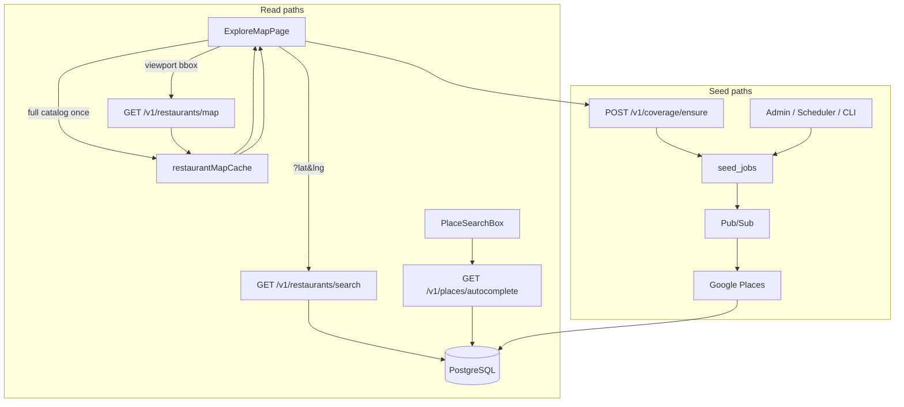

# Map search & restaurant seeding

Reference for how the pilot map loads and filters restaurants, how catalog seeding works, performance characteristics, and location-based background seeding on web and iOS.

**Status:** Current implementation (June 2026). Describes live behavior in `web/`, `api/`, and admin tooling.

**Related docs:** [DESIGN.md](DESIGN.md), [BEST_PRACTICES.md](BEST_PRACTICES.md), [FIREBASE_AUTH.md](FIREBASE_AUTH.md), [api/README.md](../api/README.md).

---

## Executive summary

| Concern | Today |
|---------|-------|
| **User search** | Multiple modes: viewport bbox catalog load, radius search, typeahead, client-side browse filters |
| **Map load** | `GET /v1/restaurants/map` with pre-aggregated JOINs; optional bbox; shared in-memory cache + HTTP ETag |
| **Catalog seeding** | Google Places in circular areas; admin/scheduler/CLI + signed-in `POST /v1/coverage/ensure` |
| **iOS** | Planned (MapKit + Core Location) — same API contract when Phase 3 starts |

**Search and seeding are separate systems.** Slow explore is usually **initial data load** or **uncached repeat fetches**, not slow text filtering. Missing restaurants near the user is usually a **coverage** problem, not a search bug.

---

## 1. How user-facing map search works (web)

### Routes and page

| Route | Component | Notes |
|-------|-----------|-------|
| `/map` | `ExploreMapPage` | Combined map + sidebar list; search, pins, shared catalog cache |
| `/restaurants` | `ExploreMapPage` | Same component; filter links stay on current path |

There is no separate list-only page — explore is a single combined view.

### Search modes

#### A. Default catalog browse (no `?lat`/`lng`)

```
ExploreMapPage (catalog mode)
  → map idle → debounced viewport bbox
  → GET /v1/restaurants/map?min_lat=…&max_lat=…&min_lng=…&max_lng=…
  → merge into shared restaurantMapCache (web/src/lib/restaurantMapCache.ts)
  → client filter in exploreFacets.ts (?q, ?city, ?zip, ?tag, ?filter)
```

- Does **not** fetch the full catalog on mount — loads the visible viewport (plus padding) and merges as the user pans
- Browse facet chips reflect **loaded** restaurants (grows as the user explores)
- Typing in the sidebar search box updates URL only — **no API call** (client substring filter)

#### B. Place / radius search (`?lat=&lng=&radius=&place=`)

```
PlaceSearchBox → Google place or catalog hit
  → resolve + GET /v1/places/{id}/entry (fast path: focus pin + detail sheet)
  → ?lat=&lng=&radius=8000&focus=place:…
  → GET /v1/places/nearby (signed-in; merges Google + SQL rated rows)
  → POST /v1/coverage/ensure (background seed, 1 km on search select)
  → nearby pins pop in; selected venue kept even if not in top-20 nearby
```

Signed-out fallback: `GET /v1/restaurants/search` (Haversine on SQL catalog only).

Restaurant name selection can also enter radius mode via `buildRestaurantRadiusParams()`.

#### C. Typeahead (search box)

Requires sign-in (Google spend gated):

```
GET /v1/places/autocomplete?q=…&session_token=…
  → up to 5 catalog ILIKE hits + up to 5 Google place predictions
```

Selecting a **restaurant** → focus + `GET /places/{id}/entry` or catalog detail + 1 km `coverage/ensure`.  
Selecting a **place** → resolve + entry fetch + focus + nearby async + `coverage/ensure`.

### Client-side filtering (catalog mode)

After data is in the shared cache, filtering happens in memory in `web/src/lib/exploreFacets.ts`:

- `matchesExploreSearch()` — substring on name, address, cuisine tags
- `matchesBrowseFilters()` — city/ZIP from address string, cuisine tag
- `matchesScoutFilter()` — fast-starters / parent-data / needs-data
- `buildExploreFacets()` — town/ZIP/tag chips from loaded dataset

URL params: `q`, `filter`, `city`, `zip`, `tag`, `focus`, `lat`, `lng`, `radius`, `place`, `place_id`.

### Map rendering

`web/src/components/RestaurantMap.tsx` + `MapMarkerLayer.tsx`:

- Google Maps JS via `@vis.gl/react-google-maps`
- Default center: Dedham pilot (`42.2418, -71.1662`)
- **`clickableIcons={false}`** — native Google POI clicks disabled; use Little Scout pins
- Search-focus pin: sky blue (`pinSearchFocus` / `#3FA7D6`); Google-only (not in SQL) pins: dashed discover ring
- Venue search zoom 17; area/radius zoom 12
- **Pin clustering** at zoom ≤ 13 when > 12 pins (`@googlemaps/markerclusterer`)
- Full custom pins at higher zoom
- `FitBounds` fits loaded pins; `ViewportWatcher` fires on map idle
- “Search this area” when viewport has ≤ 3 restaurants (sparse CTA)

Map pan/zoom triggers **bbox catalog loads** in default mode (debounced 300 ms), not full-catalog refetch.

### Shared client cache

`web/src/lib/restaurantMapCache.ts`:

| Feature | Behavior |
|---------|----------|
| In-memory merge | All `/map` fetches merge by restaurant id |
| Stale time | 5 minutes for full-catalog flag |
| ETag revalidation | `listRestaurantsForMapCached()` sends `If-None-Match` |
| Home + Explore | Same cache — Home loads full catalog once; Explore reuses it |
| Invalidation | After coverage seed completes |

Home uses `useFullRestaurantCatalog()` (full `/map` once, cached).  
Explore catalog mode uses `useRestaurantMapEntries()` + `useMapViewportRestaurants()`.

### HTTP caching (API)

`api/ttf_api/http_cache.py` — `ETagMiddleware` on `GET /v1/restaurants/map`:

- `Cache-Control: public, max-age=30, stale-while-revalidate=300`
- Strong ETag → `304 Not Modified` on repeat reads

---

## 2. API endpoints

### Public read (map / list / search)

| Method | Path | Handler | Notes |
|--------|------|---------|-------|
| GET | `/v1/restaurants` | `list_restaurants()` | Optional `q` (name `ILIKE`), `cuisine`. Unused by explore UI today. |
| GET | `/v1/restaurants/map` | `list_restaurants_for_map()` | TTF + note/rating aggregates. Optional bbox (`min_lat`, `max_lat`, `min_lng`, `max_lng`). ETag cached. |
| GET | `/v1/restaurants/search` | `search_restaurants()` | Required `lat`, `lng`; optional `radius_m`, `q`, `limit`. Haversine sort. |
| GET | `/v1/restaurants/{id}` | `get_restaurant()` | Single restaurant + TTF aggregate |
| GET | `/v1/places/autocomplete` | `autocomplete()` | Auth + App Check; catalog + Google predictions |
| GET | `/v1/places/resolve` | `resolve_place()` | Place id → lat/lng label |

Implementation: `api/ttf_api/routers/restaurants.py`, `places.py`

The `/map` query uses **pre-aggregated LEFT JOINs** (one scan per child table) instead of per-row LATERAL subqueries. Indexes on `pilot_city` and `(lat, lng)` support bbox filters.

### Coverage (signed-in users)

| Method | Path | Auth | Purpose |
|--------|------|------|---------|
| POST | `/v1/coverage/ensure` | User + App Check | Rate-limited area seed wrapper |
| GET | `/v1/coverage/jobs/{job_id}` | User (own jobs) | Poll seed status |

### Seeding / refresh (admin + background)

| Method | Path | Auth | Purpose |
|--------|------|------|---------|
| POST | `/v1/admin/seed-jobs` | Admin | Geocode location → enqueue Places seed job + GCP console links |
| GET | `/v1/admin/seed-jobs/{job_id}` | Admin | Poll seed job |
| GET/POST/PATCH/DELETE | `/v1/admin/seed-locations` | Admin | Manage seed areas |
| POST | `/v1/admin/refresh-runs` | Admin | Refresh all enabled seed locations + catalog pass |
| POST | `/v1/internal/pubsub/seed-jobs` | Internal | Pub/Sub worker runs seed |
| POST | `/v1/internal/scheduled-restaurant-refresh` | Internal | Cloud Scheduler entry |

### Manual create (not Places)

| Method | Path | Purpose |
|--------|------|---------|
| POST | `/v1/restaurants` | Authenticated user creates a row directly |

---

## 3. How catalog seeding works

Restaurants enter Postgres primarily via **Google Places** (plus manual `POST /v1/restaurants`).

### Area model

Defined in `api/ttf_api/places_seed.py` as `SeedArea`:

- Center `lat` / `lng`
- `radius_m` (default **8000** m ≈ 5 mi)
- `area_key`: `"{round(lat,3)}:{round(lng,3)}:{radius_m}"` — dedupes nearby geocodes

Default center: `42.2418, -71.1662`. Catalog key: `dedham-ma` (opaque).

### Triggers

1. **CLI** — `api/scripts/seed_restaurants.py`
2. **Local bootstrap** — `scripts/start-local.sh` if count = 0
3. **Admin UI** — `web/src/pages/admin/AdminLocationSeedingPage.tsx`
4. **Cloud Scheduler** — → `POST /v1/internal/scheduled-restaurant-refresh`
5. **Web users** — `POST /v1/coverage/ensure` (near me, search this area, radius mode)

### User coverage flow (web)

```
"Show restaurants near me" / "Search this area" / radius mode entry
  → POST /v1/coverage/ensure { lat, lng, radius_m }
  → density check, per-user daily cap, 24h area_key cooldown
  → enqueue seed job → Pub/Sub → run_seed_job → Google Places → upsert
  → poll GET /v1/coverage/jobs/{id}
  → invalidateRestaurantMapCache() + refetch active data source
```

Hooks: `useNearbyCoverage`, `useAreaCoverage`, `runBackgroundCoverage` in `web/src/lib/backgroundCoverage.ts`.

---

## 4. Performance characteristics

### Improvements in place

| Optimization | Where |
|--------------|-------|
| Pre-aggregated `/map` SQL | `restaurants.py` `_MAP_SELECT` |
| Shared in-memory cache + ETag | `restaurantMapCache.ts`, `http_cache.py` |
| Viewport bbox loads (not full catalog every visit) | `useMapViewportRestaurants`, `ExploreMapPage` |
| Pin clustering at low zoom | `MapMarkerLayer.tsx` |
| HTTP 304 on repeat `/map` reads | `ETagMiddleware` |

### Remaining limits

- Home landing stats still require one **full-catalog** `/map` fetch (cached 5 min; shared with Explore)
- Browse facets only cover **loaded** viewport regions until the user pans or visits Home first
- Catalog refresh (scheduled Place Details pass) cost grows with venue count
- No PostGIS / geohash server-side search beyond Haversine radius

---

## 5. Architecture diagram



---

## 6. Key files

| Layer | Paths |
|-------|-------|
| Explore UI | `web/src/pages/ExploreMapPage.tsx`, `RestaurantMap.tsx`, `MapMarkerLayer.tsx` |
| Cache | `web/src/lib/restaurantMapCache.ts`, `web/src/hooks/useRestaurantMapCatalog.ts` |
| Viewport load | `web/src/hooks/useMapViewportRestaurants.ts`, `web/src/lib/mapViewport.ts` |
| Client filter | `web/src/lib/exploreFacets.ts` |
| API map/search | `api/ttf_api/routers/restaurants.py`, `map_query.py` |
| HTTP cache | `api/ttf_api/http_cache.py` |
| Seeding | `api/ttf_api/places_seed.py`, `seed_jobs.py`, `coverage.py` |
| Admin UI | `web/src/pages/admin/AdminLocationSeedingPage.tsx` |

---

## 7. Quick reference

| Question | Answer |
|----------|--------|
| What routes serve explore? | `/map` and `/restaurants` → `ExploreMapPage` |
| Default catalog load? | Viewport bbox → `GET /v1/restaurants/map?min_lat=…` (merged in shared cache) |
| Place/neighborhood search? | `GET /v1/restaurants/search` + background `POST /v1/coverage/ensure` |
| Sidebar text filter? | Client-only (`exploreFacets.ts`), URL `?q=` |
| Typeahead? | `GET /v1/places/autocomplete` (auth required) |
| Who can seed? | Admins, scheduler, CLI, signed-in users via `/v1/coverage/ensure` |
| Refresh after seed? | Invalidate cache → refetch bbox or radius results |
| iOS status? | Planned; no implementation in repo yet |
