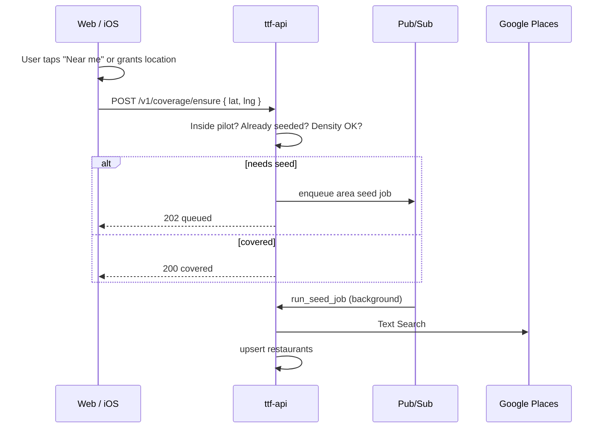

# Map search & restaurant seeding

Reference for how the pilot map loads and filters restaurants, how catalog seeding works, why explore can feel slow, and how location-based background seeding could work on web and iOS.

**Status:** Research / design reference (June 2026). Describes current implementation plus proposed improvements not yet built.

**Related docs:** [DESIGN.md](DESIGN.md) (product + iOS plans), [BEST_PRACTICES.md](BEST_PRACTICES.md) (caching, bbox, geolocation UX), [FIREBASE_AUTH.md](FIREBASE_AUTH.md) (admin-only seed endpoints), [api/README.md](../api/README.md) (endpoint summary).

---

## Executive summary

| Concern | Today | Gap |
|---------|-------|-----|
| **User search** | Fetch entire pilot catalog; filter in browser | No server-side bbox, radius, or viewport query |
| **Map load** | `GET /v1/restaurants/map` with per-restaurant SQL aggregates | Heavy query; refetched on every route visit |
| **Catalog seeding** | Google Places in circular areas; admin/scheduler/CLI only | Not tied to user location or map viewport |
| **iOS** | Planned (MapKit + Core Location) | No `ios/` code in repo yet |

**Search and seeding are separate systems.** Slow explore is usually slow **data load**, not slow text filtering. Missing restaurants near the user is usually a **coverage** problem, not a search bug.

---

## 1. How user-facing map search works (web)

### Data loading

All three explore surfaces use the same endpoint:

| Page | File | API call |
|------|------|----------|
| Home | `web/src/pages/HomePage.tsx` | `api.listRestaurantsForMap()` |
| Explore list | `web/src/pages/RestaurantListPage.tsx` | same |
| Map | `web/src/pages/MapPage.tsx` | same |

Client: `web/src/api/client.ts` → `GET /v1/restaurants/map`

`listRestaurants()` (`GET /v1/restaurants?q=…`) supports server-side name search but is **not used** by any page today.

### Client-side filtering

After the full catalog loads, filtering happens in memory in `web/src/lib/exploreFacets.ts`:

- `matchesExploreSearch()` — substring on name, address, cuisine tags
- `matchesBrowseFilters()` — city/ZIP from address string, cuisine tag
- `matchesScoutFilter()` — fast-starters / parent-data / needs-data
- `buildExploreFacets()` — town/ZIP/tag chips from full dataset

URL params on `/restaurants` (`q`, `filter`, `city`, `zip`, `tag`) are applied client-side only.

**Typing in the search box does not call the API.**

### Map rendering

`web/src/components/RestaurantMap.tsx`:

- Google Maps JS via `@vis.gl/react-google-maps` (`VITE_GOOGLE_MAPS_API_KEY`)
- Fixed center: Dedham (`DEDHAM_CENTER`)
- `FitBounds` fits all pins; no viewport-based API query
- `FocusRestaurant` pans to `?focus=<id>` from URL
- Pin styling: `web/src/lib/mapPin.ts`, `web/src/lib/ttfTier.ts`
- No clustering; every venue gets an `AdvancedMarker`

Map pan/zoom does **not** trigger API calls.

### Refresh behavior

`web/src/hooks/useRefreshOnNavigate.ts` re-runs the fetch effect on every navigation to a route (via `location.key`). Visiting Home → Map → Explore refetches `/map` three times.

There is no React Query/SWR layer — plain `useState` + `fetch`.

### User search flow (current)

```
[HomePage | RestaurantListPage | MapPage]
        |
        |  GET /v1/restaurants/map  (on each route enter)
        v
[API: list_restaurants_for_map]
        |
        |  SQL: restaurants + 3× LATERAL aggregates
        v
[PostgreSQL: all active dedham-ma restaurants]
        |
        |  JSON RestaurantMapEntry[]
        v
[Browser: restaurants[] state]
        |
        +---> List: exploreFacets filters (q, city, zip, tag, scout)
        +---> Map: render all pins, FitBounds
        +---> Home: landing card metrics
```

### Text search flow (client-only)

```
User types in search box
        → URL ?q=... updated
        → matchesExploreSearch(restaurant, q)
        → filtered list re-render (no API call)
```

---

## 2. API endpoints

### Public read (map / list)

| Method | Path | Handler | Notes |
|--------|------|---------|-------|
| GET | `/v1/restaurants` | `list_restaurants()` | Optional `q` (name `ILIKE`), `cuisine`. No lat/lng/bbox. |
| GET | `/v1/restaurants/map` | `list_restaurants_for_map()` | All active pilot-city restaurants + TTF aggregates + note/rating counts. **No geo filter.** |
| GET | `/v1/restaurants/{id}` | `get_restaurant()` | Single restaurant + TTF aggregate |

Implementation: `api/ttf_api/routers/restaurants.py`

The `/map` query runs three `LEFT JOIN LATERAL` subqueries per restaurant (TTF percentile, notes count, attribute ratings count). Indexes exist on `pilot_city` and `(lat, lng)` but spatial filters are not used.

### Seeding / refresh (admin + background)

| Method | Path | Auth | Purpose |
|--------|------|------|---------|
| POST | `/v1/restaurants/seed-jobs` | Admin | Geocode location → enqueue Places seed job |
| GET | `/v1/restaurants/seed-jobs/{job_id}` | Admin | Poll seed job |
| POST | `/v1/admin/seed-jobs` | Admin | Same + GCP console links |
| GET/POST/PATCH/DELETE | `/v1/admin/seed-locations` | Admin | Manage seed areas |
| POST | `/v1/admin/refresh-runs` | Admin | Refresh all enabled seed locations + catalog pass |
| POST | `/v1/internal/pubsub/seed-jobs` | Internal | Pub/Sub worker runs seed |
| POST | `/v1/internal/scheduled-restaurant-refresh` | Internal | Cloud Scheduler entry |

Seeding endpoints require `role=admin` on the public restaurants router (Maps API cost control). See [FIREBASE_AUTH.md](FIREBASE_AUTH.md).

### Manual create (not Places)

| Method | Path | Purpose |
|--------|------|---------|
| POST | `/v1/restaurants` | Authenticated user creates a row directly (no Places lookup) |

---

## 3. How catalog seeding works

Restaurants enter Postgres primarily via **Google Places** (plus manual `POST /v1/restaurants`).

### Area model

Defined in `api/ttf_api/places_seed.py` as `SeedArea`:

- Center `lat` / `lng`
- `radius_m` (default **8000** m ≈ 5 mi)
- `label` (human-readable area name)
- `area_key`: `"{round(lat,3)}:{round(lng,3)}:{radius_m}"` — dedupes nearby geocodes

Default center: Dedham `42.2418, -71.1662` (`api/ttf_api/config.py`). Pilot city: `dedham-ma`.

Results are filtered with Haversine `within_area()` — places outside the circle are skipped (`out_of_area`).

**Seeding is explicitly area-based, not driven by the user’s map pan/zoom.**

### Google APIs used (server key only)

| API | Purpose |
|-----|---------|
| Geocoding | Resolve ZIP/city/address string → lat/lng |
| Places Text Search (New) | Area discovery with `locationBias.circle` |
| Place Details (New) | Catalog-wide refresh of known `google_place_id` values |

Field mask and URLs: `api/ttf_api/places_seed.py`

**Web map key** (`VITE_GOOGLE_MAPS_API_KEY`) is separate — Maps JavaScript for rendering only.

### Search queries per area seed

Initial area seed runs four Text Search queries, e.g.:

- `"restaurants near {label}"`
- `"family restaurants near {label}"`
- `"pizza near {label}"`
- `"breakfast near {label}"`

Scheduled refresh uses `RESTAURANT_SEED_REFRESH_QUERIES` (Dedham-specific defaults in config).

### Job kinds

Stored on `restaurant_seed_jobs.kind`:

| Kind | Behavior |
|------|----------|
| `area` | Places Text Search in a circle; on refresh, tombstones active venues in area not seen in Places |
| `catalog` | Place Details for every known `google_place_id` in pilot city |

### Triggers

1. **CLI** — `api/scripts/seed_dedham.py`, `api/ttf_api/jobs/refresh_restaurants.py` (sync `run_seed_job`)
2. **Local bootstrap** — `scripts/start-local.sh` seeds if restaurant count is 0
3. **Admin UI** — `web/src/pages/admin/AdminLocationSeedingPage.tsx`
4. **Cloud Scheduler** — weekly (configurable) → `POST /v1/internal/scheduled-restaurant-refresh` → `create_scheduled_refresh_jobs()`

### Background execution

```
Trigger (admin / scheduler / CLI)
        → create_seed_job(area)
        → enqueue_seed_job (Pub/Sub in prod, BackgroundTasks or sync locally)
        → run_seed_job(job_id)
        → Google Places APIs
        → upsert restaurants + restaurant_changelog
        → job status = succeeded
```

Infra: `infra/terraform/environments/dev/location-seeding.tf` — topic `ttf-restaurant-seed-jobs`, push to API with OIDC.

### Dedup and cooldown

`create_seed_job()` in `api/ttf_api/seed_jobs.py` reuses an existing job if:

- Status is `pending` or `running`, or
- Status is `succeeded` and `finished_at` is within `RESTAURANT_SEED_COOLDOWN_HOURS` (default **24h**) for the same `area_key`

Pass `force=true` to bypass (admin refresh, scheduled refresh).

### DB write path

- Upsert by `google_place_id`
- Set `cuisine_tags` from Places types
- Track `status` (`active`, `closed`, `tombstoned`, etc.)
- Log changes to `restaurant_changelog`
- Register successful area seeds in `seed_locations` for future scheduled refresh

### Seeding flow (end-to-end)

```
1. TRIGGER
   ├─ First-time local: start-local.sh → seed_dedham.py
   ├─ Manual/prod: seed_dedham.py or seed_production.sh
   ├─ Admin: POST /v1/admin/seed-jobs { location: "02026", radius_m: 8000 }
   ├─ Admin refresh: POST /v1/admin/refresh-runs
   └─ Scheduled: Cloud Scheduler → /v1/internal/scheduled-restaurant-refresh

2. JOB CREATION (restaurant_seed_jobs row, status=pending)

3. ENQUEUE (Pub/Sub prod | BackgroundTasks/sync local)

4. PLACES FETCH
   ├─ Geocode location string (if provided)
   ├─ area job: Text Search × N queries, paginated, locationBias circle
   └─ catalog job: Place Details per known google_place_id

5. NORMALIZE + FILTER (require id, name, address, lat/lng; Haversine within radius)

6. UPSERT restaurants (pilot_city = dedham-ma)
   ├─ New → INSERT + changelog "added"
   ├─ Existing → UPDATE + changelog
   └─ Refresh: tombstone active venues in area not seen in Places

7. REGISTER seed_locations (on successful non-refresh area seed)

8. JOB COMPLETE
```

### Key files

| Layer | Paths |
|-------|-------|
| Core logic | `api/ttf_api/places_seed.py`, `api/ttf_api/seed_jobs.py`, `api/ttf_api/pubsub_seed.py` |
| Routers | `api/ttf_api/routers/restaurants.py`, `admin.py`, `internal.py` |
| CLI | `api/scripts/seed_dedham.py`, `api/scripts/seed_production.sh` |
| Migrations | `005_restaurant_seed_jobs.sql`, `006_location_seeding.sql`, `007_seed_locations.sql` |
| Config | `api/ttf_api/config.py` |
| Admin UI | `web/src/pages/admin/AdminLocationSeedingPage.tsx` |

---

## 4. Why explore feels slow

Two distinct problems can feel like “slow search.”

### A. Load latency (most likely)

| Bottleneck | Where | Why |
|------------|-------|-----|
| Heavy `/map` SQL | `list_restaurants_for_map()` | 3 LATERAL subqueries per restaurant |
| Full payload | API + web | No bbox, pagination, or HTTP cache |
| Repeated fetches | `useRefreshOnNavigate` | Same endpoint on Home, Map, List route entry |
| No client cache | web | No React Query/SWR |
| All pins rendered | `RestaurantMap.tsx` | No clustering |

Text filtering is instant once data is loaded. If typing feels slow, the initial load may still be in progress or the UI is re-rendering a large list.

### B. Coverage gaps (feels like bad search)

Users outside the default ~8 km Dedham seed circle (e.g. adjacent towns) may see few or no restaurants. That is missing catalog data, not slow filtering.

The map reads the full seeded catalog for `dedham-ma`; it does not trigger or scope seeding.

### Admin seed path slowness (not user-facing)

Places seeding is intentionally throttled (`time.sleep` between pages/queries) and does one Place Details call per restaurant on catalog refresh. Relevant for ops, not pilot users.

---

## 5. “If we see a restaurant, should we seed others?”

**At view time: no.** Viewing a restaurant on the map does not trigger seed or refresh.

**At seed time: yes, implicitly.** An area seed job does not stop at one venue. `seed_restaurants_for_area()` runs multiple Places queries and upserts every place inside the circle — often dozens of restaurants per job.

What is missing is **on-demand coverage expansion** when a user is in an under-seeded area. The right unit of work is already modeled: **area** (`lat`, `lng`, `radius_m`) with `area_key` dedup — not “seed neighbors of this one restaurant row.”

---

## 6. Location-based background seeding

**Status:** Web MVP **implemented** (June 2026). `POST /v1/coverage/ensure` plus a "Show restaurants near me" control on the map. iOS (Phase 3) still pending.

### Goal

Web and iOS request device location (with consent), then kick off a **background** area seed or refresh for that location without blocking the UI — reusing the existing Pub/Sub seed pipeline.

### Why not expose today’s admin endpoint?

`POST /v1/restaurants/seed-jobs` is admin-only because each area seed costs Google Places API calls. Public clients need a guarded wrapper.

### API (implemented)

`POST /v1/coverage/ensure` — `api/ttf_api/routers/coverage.py`:

```json
{ "lat": 42.24, "lng": -71.17, "radius_m": 8000 }
```

Requires a Firebase-authenticated user (plus App Check when enforced). `radius_m`
defaults to 8000 and is clamped to 1000–25000.

**Behavior:**

1. Validate coordinates inside the pilot metro bounding box (`pilot_bbox_*` in `config.py`). Outside → `{ status: "out_of_area" }`.
2. Check active-restaurant density in radius (Haversine `COUNT(*)`, `coverage.count_active_within`) — if ≥ `coverage_min_restaurants`, return `{ status: "covered", restaurant_count }`, no Places spend.
3. Enforce per-user daily area cap (`coverage_max_areas_per_day`, distinct `area_key` in last 24h) → `429`.
4. Call `create_seed_job()` + `enqueue_seed_job()` (existing code), enqueueing only `pending` jobs.
5. Return `{ status: "queued", job_id, reused }`.

Status is carried in the body (always `200`) so the client switches on `status`.

**Guards:**

| Guard | Where |
|-------|-------|
| Firebase auth required | `Depends(get_current_user)` + `verify_app_check` |
| Reuse `area_key` 24h cooldown | `create_seed_job()` (existing) |
| Max new areas per user per day | `coverage_max_areas_per_day` |
| Skip when already dense | `coverage_min_restaurants` |
| Pilot metro bbox server-side | `pilot_bbox_*` |

### Proposed client flow



### Web (implemented)

- `useNearbyCoverage()` (`web/src/hooks/useNearbyCoverage.ts`) calls `navigator.geolocation` only on the explicit "Show restaurants near me" button on `MapPage` — per [BEST_PRACTICES.md](BEST_PRACTICES.md).
- Fire-and-forget `POST /v1/coverage/ensure` via `api.ensureCoverage()`; does not block map render.
- On `queued`, the map soft-refreshes after ~25s (`COVERAGE_REFRESH_DELAY_MS`).
- Requires sign-in; the control hints to sign in when no `idToken` is present.

Still open: sparse-viewport CTA, job-status polling instead of a fixed delay.

### iOS (Phase 3)

- `CLLocationManager` with when-in-use authorization.
- Same `POST /v1/coverage/ensure` contract.
- `BGAppRefreshTask` only if background refresh while app is suspended is required — usually overkill for v1.

Planned stack: Apple MapKit + Core Location per [DESIGN.md](DESIGN.md). No iOS code in repo yet.

### Constraints

1. **Google Maps Platform terms** — `place_id` may be stored indefinitely; lat/lng from Geocoding/Places may only be cached up to 30 consecutive days. Little Scout stores our own restaurant rows in Postgres; Places is for seeding only. See [BEST_PRACTICES.md](BEST_PRACTICES.md).
2. **Cost** — Each new area ≈ geocode + 4+ Text Search pages + upserts. Cooldown and per-user caps are essential.
3. **Privacy** — No geolocation on page load without consent.
4. **Separate from search perf** — Coverage seeding does not fix slow `/map` loads.

---

## 7. Recommended priorities

### Fix perceived search slowness (no extra Places cost)

1. **Shared client cache** across Home / Map / List (React Query with `staleTime`, or context store) — eliminate triple-fetch.
2. **Lighten `/map`** — materialized TTF aggregates, or split lightweight pin payload from detail aggregates.
3. **Bbox query params** when catalog grows (`min_lat`, `max_lat`, …) — documented in [BEST_PRACTICES.md](BEST_PRACTICES.md), not implemented.
4. **Pin clustering** at low zoom.
5. **HTTP caching** — short CDN TTL + ETag on public list endpoints.

### Fix coverage gaps (Places cost, controlled)

1. ✅ `POST /v1/coverage/ensure` wrapping existing seed jobs.
2. ✅ Web: location permission → background enqueue (`useNearbyCoverage`). iOS pending.
3. Optional sparse-viewport CTA on map.

### iOS

Same API as web when Phase 3 starts. Core Location when-in-use is sufficient for v1.

---

## 8. Gaps vs design docs

[DESIGN.md](DESIGN.md) and [BEST_PRACTICES.md](BEST_PRACTICES.md) describe patterns **not yet built**:

- Bbox / PostGIS spatial search
- Geohash cache keys
- CDN TTL + `stale-while-revalidate`
- Map-idle debouncing and “search this area”
- Pin clustering
- Server-enforced pilot-city bounding box on queries

The live system fits a **single-metro pilot with hundreds of venues** but will degrade as catalog and observation volume grow, mainly due to per-restaurant aggregate joins on `/map` and lack of caching/pagination.

---

## 9. Quick reference

| Question | Answer |
|----------|--------|
| How does search work? | Fetch all restaurants + aggregates; filter client-side |
| Why is it slow? | Heavy `/map` SQL, no cache, refetch on every route |
| Does viewing a restaurant seed others? | No at view time; yes during area seed (many venues per circle) |
| Can location trigger background seed? | Yes (web) — `POST /v1/coverage/ensure`, rate-limited, reuses the Pub/Sub pipeline |
| Who can seed today? | Admins, scheduler, CLI only |
| iOS status? | Planned; no implementation in repo |
