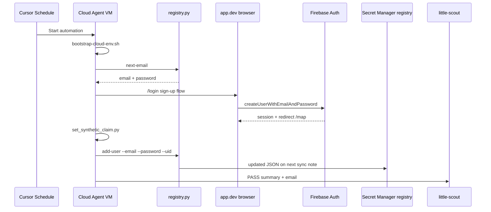

# Scheduled signup automation — spec

Cursor Automation that **creates one synthetic agent account per day** on `app.dev`, registers it, and posts to `#little-scout`.

**Parent doc:** [SYNTHETIC_USERS.md](SYNTHETIC_USERS.md) (full synthetic-user program)

---

## Purpose

Grow a pool of tagged test users (`scout-agent-{nn}@littlescout.app`) for later search / submit / edit automations — without manual signup. Each run exercises the **real parent signup path** (Firebase + App Check + web UI).

| In scope | Out of scope |
|----------|--------------|
| One email/password signup per scheduled run | Google OAuth |
| Firebase `synthetic: true` claim | Prod |
| Registry update in Secret Manager | Search, TTF submit, edit (separate automations) |
| Slack summary to `#little-scout` | More than 1 account per run |

---

## Automation identity

| Field | Value |
|-------|-------|
| **Name** | `scout-synthetic-signup-daily` |
| **Trigger** | Scheduled — cron `0 14 * * *` (9:00 US Eastern / 14:00 UTC) |
| **Repository** | `samueljoeharris/restaurant_app` @ `main` |
| **Environment** | Little Scout Cloud Agent V1 |
| **Tools** | Send to Slack |
| **Prompt file** | [`.cursor/automations/scout-synthetic-signup-daily.md`](../.cursor/automations/scout-synthetic-signup-daily.md) |

Use a **dedicated** automation for signup only — do not mix with search/submit in the same scheduled job (simpler failures, clearer Slack signal).

---

## Prerequisites (one-time)

### 1. Secret Manager — agent registry

```bash
echo '{
  "email_domain": "littlescout.app",
  "email_prefix": "scout-agent",
  "next_index": 1,
  "users": []
}' | gcloud secrets versions add ttf-agent-users-registry \
  --project=ttf-restaurant-dev --data-file=-
```

Terraform dev stack must include `ttf-agent-users-registry` in `secret_ids` (see `infra/terraform/environments/dev/main.tf`). After apply, cloud agents get `.secrets/agent-users-registry.json` via `./scripts/sync-secrets.sh`.

### 2. Cloud Agent secrets

- Runtime Secret: `GCP_DEV_SYNC_SA_JSON` ([docs/CLOUD_AGENT.md](CLOUD_AGENT.md))
- Slack integration connected in Cursor dashboard

### 3. Firebase rules for synthetic users

- No MFA on `@littlescout.app` agent accounts
- Email/password provider enabled on `ttf-restaurant-dev`

---

## Run flow (single account)



### Step-by-step

1. **Bootstrap** — if `.secrets/` empty: `bash .cursor/scripts/bootstrap-cloud-env.sh`
2. **Allocate email** — `python3 scripts/synthetic-users/registry.py next-email`  
   Example: `scout-agent-01@littlescout.app` + generated password (≥6 chars)
3. **Browser signup** (validates App Check + UI):
   - Open `https://app.dev.littlescout.app/login`
   - Viewport: **390×844** (mobile) or **1280×900** (desktop) — both work after mobile pilot
   - Tap **Need an account? Sign up**
   - Fill email + password → **Create account**
   - **Pass:** redirect to map (`/` or `/map`); bottom nav or map visible while signed in
4. **Tag synthetic** — `./scripts/run-api-script.sh set_synthetic_claim.py --email 'EMAIL'`  
   Capture `uid=` from stdout
5. **Register** — `python3 scripts/synthetic-users/registry.py add-user --email 'EMAIL' --password 'PWD' --uid 'UID'`
6. **Slack** — post to `#little-scout` (format below)

### Idempotency

- If signup fails with **email already in use**, run `set_synthetic_claim` + `add-user` if missing from registry, then **PASS with note** — do not create a second account same run
- If registry already has user for today's index, `next-email` still advances index — avoid reusing emails manually

---

## Slack report format

```
Scout signup — PASS | FAIL
Email: scout-agent-01@littlescout.app
UID: abc123…
Map loaded: yes/no
Notes: (errors or "ok")
```

On **FAIL**, attach a screenshot (login error, App Check, MFA prompt, blank page).

---

## Success criteria

| Check | Expected |
|-------|----------|
| Firebase Auth | New user visible; email verified not required for password provider |
| Custom claim | `synthetic: true` after `set_synthetic_claim.py` |
| Registry | User row in `.secrets/agent-users-registry.json` with uid |
| app.dev | Signed-in map loads without console auth errors |
| Slack | Message in `#little-scout` within 15 min of schedule |
| Cadence | At most **1** new account per automation run |

---

## Failure modes

| Symptom | Likely cause | Action |
|---------|--------------|--------|
| App Check 401 after signup | Page not fully loaded | Wait, retry once; screenshot if persists |
| MFA challenge | User had MFA enabled | Fail; fix in Firebase console |
| `EMAIL_EXISTS` | Prior partial run | Sync registry; tag existing user; PASS with note |
| Registry missing | SM not seeded | Run prerequisite seed command |
| `Service account not found` | sync-secrets not run | bootstrap-cloud-env.sh |
| Rate limit | N/A for signup | Report if Firebase quota hit |

---

## Cursor UI checklist

Create at [cursor.com/automations/new](https://cursor.com/automations/new):

- [ ] Name: `scout-synthetic-signup-daily`
- [ ] Trigger: Scheduled → cron `0 14 * * *` (or Daily preset ~9am ET)
- [ ] Repository: this repo, branch `main`
- [ ] Environment: **Little Scout Cloud Agent V1**
- [ ] Tools: **Send to Slack** enabled
- [ ] Prompt: copy from [scout-synthetic-signup-daily.md](../.cursor/automations/scout-synthetic-signup-daily.md) (below `---`)
- [ ] Save → **Run once** manually before enabling schedule
- [ ] Confirm Slack message and Firebase user

---

## Related automations (later)

| Automation | Trigger | Purpose |
|------------|---------|---------|
| `scout-synthetic-slack` | Slack `#little-scout` | On-demand signup/search/submit |
| `scout-synthetic-daily` | Scheduled | Mixed scenario rotation (optional; prefer separate jobs) |

---

## Decisions (locked in)

- Slack: `#little-scout`
- Email: `scout-agent-{nn}@littlescout.app`
- Aggregates: synthetic users count on app.dev; prod will not run agents
